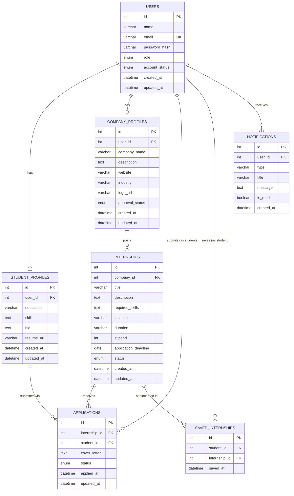

# Database Design Document
## Internship Management Portal

**Document Version:** 1.0
**Database Engine:** MySQL 8.x
**Related Documents:** `docs/00_Project_Overview.md`, `docs/01_Software_Requirements_Specification.md`, `docs/03_API_Design.md`

---

## 1. Database Overview

The Internship Management Portal uses a single relational **MySQL** database to persist all platform data — user accounts, role-specific profiles, internship postings, applications, saved (bookmarked) internships, and notifications.

Design principles guiding this schema:

- **Single source of truth via `users`:** All accounts (Student, Company, Admin) share one `users` table for authentication, with role-specific detail split into dedicated profile tables (`student_profiles`, `company_profiles`). This avoids duplicating authentication logic per role while still enforcing role-specific fields.
- **Third Normal Form (3NF):** The schema is normalized to eliminate redundant data and update anomalies (see Section 3).
- **Referential integrity by design:** All relationships are enforced with foreign keys and explicit `ON DELETE` / `ON UPDATE` rules (see Section 6).
- **Auditable status transitions:** Status fields (application status, internship status, company approval status) are modeled as constrained enumerations rather than free text, enabling reliable filtering and state-machine enforcement at the application layer.
- **Extensibility:** The schema anticipates the future enhancements listed in the SRS (e.g., audit logging, ratings) without requiring destructive changes to core tables.

---

## 2. Entity Relationship Diagram



### Explanation

- **`USERS`** is the central authentication entity for all three roles. Each user optionally has exactly one associated `STUDENT_PROFILES` or `COMPANY_PROFILES` row, depending on `role`. Admin users have neither profile row — their identity lives entirely in `users`.
- **`COMPANY_PROFILES`** owns zero or more `INTERNSHIPS`. Only companies can create internships, and each internship belongs to exactly one company.
- **`INTERNSHIPS`** receives zero or more `APPLICATIONS`, each of which is submitted by exactly one student (via `STUDENT_PROFILES`/`USERS`).
- **`SAVED_INTERNSHIPS`** is a many-to-many junction table between students and internships (a student can save many internships; an internship can be saved by many students).
- **`NOTIFICATIONS`** belongs to a single user of any role, representing in-app alerts (application status changes, company approval decisions, etc.).

---

## 3. Database Normalization

The schema is normalized to **Third Normal Form (3NF)**:

- **1NF (Atomicity):** All columns hold atomic values. Multi-valued data such as a student's `skills` or an internship's `required_skills` is stored as JSON text rather than comma-separated strings, preserving atomicity of the column's *logical* value while avoiding a premature many-to-many `skills` table not required by current functional scope. (See Section 9 for a note on when to normalize this further.)
- **2NF (No Partial Dependency):** Every table uses a single-column surrogate primary key (`id`), so partial dependency on a composite key is not applicable — all non-key attributes depend on the whole key.
- **3NF (No Transitive Dependency):** Attributes depend only on their table's primary key:
  - Authentication data (`email`, `password_hash`, `role`, `account_status`) lives only in `users`, not duplicated into profile tables.
  - Company approval status lives in `company_profiles`, not duplicated onto every internship row.
  - Application status lives in `applications`, not derived redundantly elsewhere.
- **No duplicate data:** Foreign keys reference the owning table rather than copying descriptive fields (e.g., `internships.company_id` references `company_profiles`, rather than storing `company_name` on every posting).

---

## 4. Tables

### 4.1 `users`

**Purpose:** Stores core authentication and identity data for every account on the platform (Student, Company, Admin).

| Column | Data Type | Constraints | Default |
|--------|-----------|-------------|---------|
| `id` | `INT UNSIGNED` | `PRIMARY KEY`, `AUTO_INCREMENT` | — |
| `name` | `VARCHAR(100)` | `NOT NULL` | — |
| `email` | `VARCHAR(191)` | `NOT NULL`, `UNIQUE` | — |
| `password_hash` | `VARCHAR(255)` | `NOT NULL` | — |
| `role` | `ENUM('student','company','admin')` | `NOT NULL` | — |
| `account_status` | `ENUM('active','deactivated')` | `NOT NULL` | `'active'` |
| `created_at` | `DATETIME` | `NOT NULL` | `CURRENT_TIMESTAMP` |
| `updated_at` | `DATETIME` | `NOT NULL` | `CURRENT_TIMESTAMP ON UPDATE CURRENT_TIMESTAMP` |

- **Primary Key:** `id`
- **Foreign Keys:** None (root entity)
- **Notes:** `password_hash` stores the bcrypt hash only — plaintext passwords are never persisted. `email` uniqueness is enforced at the database level as a second layer of defense beyond application validation.

---

### 4.2 `student_profiles`

**Purpose:** Stores student-specific profile data, extending a `users` row where `role = 'student'`.

| Column | Data Type | Constraints | Default |
|--------|-----------|-------------|---------|
| `id` | `INT UNSIGNED` | `PRIMARY KEY`, `AUTO_INCREMENT` | — |
| `user_id` | `INT UNSIGNED` | `NOT NULL`, `UNIQUE`, `FOREIGN KEY` | — |
| `education` | `VARCHAR(200)` | `NULL` | `NULL` |
| `skills` | `JSON` | `NULL` | `NULL` |
| `bio` | `TEXT` | `NULL` | `NULL` |
| `resume_url` | `VARCHAR(255)` | `NULL` | `NULL` |
| `created_at` | `DATETIME` | `NOT NULL` | `CURRENT_TIMESTAMP` |
| `updated_at` | `DATETIME` | `NOT NULL` | `CURRENT_TIMESTAMP ON UPDATE CURRENT_TIMESTAMP` |

- **Primary Key:** `id`
- **Foreign Keys:** `user_id` → `users(id)`
- **Notes:** `user_id` is `UNIQUE` to enforce a strict one-to-one relationship with `users`. `skills` is stored as `JSON` (array of strings) to support flexible, queryable skill lists without a separate lookup table at current scale.

---

### 4.3 `company_profiles`

**Purpose:** Stores company-specific profile data and admin verification status, extending a `users` row where `role = 'company'`.

| Column | Data Type | Constraints | Default |
|--------|-----------|-------------|---------|
| `id` | `INT UNSIGNED` | `PRIMARY KEY`, `AUTO_INCREMENT` | — |
| `user_id` | `INT UNSIGNED` | `NOT NULL`, `UNIQUE`, `FOREIGN KEY` | — |
| `company_name` | `VARCHAR(150)` | `NOT NULL` | — |
| `description` | `TEXT` | `NULL` | `NULL` |
| `website` | `VARCHAR(255)` | `NULL` | `NULL` |
| `industry` | `VARCHAR(100)` | `NULL` | `NULL` |
| `logo_url` | `VARCHAR(255)` | `NULL` | `NULL` |
| `approval_status` | `ENUM('pending','approved','rejected')` | `NOT NULL` | `'pending'` |
| `created_at` | `DATETIME` | `NOT NULL` | `CURRENT_TIMESTAMP` |
| `updated_at` | `DATETIME` | `NOT NULL` | `CURRENT_TIMESTAMP ON UPDATE CURRENT_TIMESTAMP` |

- **Primary Key:** `id`
- **Foreign Keys:** `user_id` → `users(id)`
- **Notes:** `approval_status` gates whether a company may publish internships (enforced at the application layer per FR-COM-02). `user_id` is `UNIQUE` for the same one-to-one reason as `student_profiles`.

---

### 4.4 `internships`

**Purpose:** Stores internship postings created by companies.

| Column | Data Type | Constraints | Default |
|--------|-----------|-------------|---------|
| `id` | `INT UNSIGNED` | `PRIMARY KEY`, `AUTO_INCREMENT` | — |
| `company_id` | `INT UNSIGNED` | `NOT NULL`, `FOREIGN KEY` | — |
| `title` | `VARCHAR(150)` | `NOT NULL` | — |
| `description` | `TEXT` | `NOT NULL` | — |
| `required_skills` | `JSON` | `NOT NULL` | — |
| `location` | `VARCHAR(150)` | `NOT NULL` | — |
| `duration` | `VARCHAR(50)` | `NOT NULL` | — |
| `stipend` | `INT UNSIGNED` | `NOT NULL` | `0` |
| `application_deadline` | `DATE` | `NOT NULL` | — |
| `status` | `ENUM('draft','published','closed','flagged','removed')` | `NOT NULL` | `'draft'` |
| `created_at` | `DATETIME` | `NOT NULL` | `CURRENT_TIMESTAMP` |
| `updated_at` | `DATETIME` | `NOT NULL` | `CURRENT_TIMESTAMP ON UPDATE CURRENT_TIMESTAMP` |

- **Primary Key:** `id`
- **Foreign Keys:** `company_id` → `company_profiles(id)`
- **Notes:** `status = 'published'` is the only state visible to students on public listing endpoints. `flagged`/`removed` transitions are Admin-only per FR-INT and the API design's moderation endpoint.

---

### 4.5 `applications`

**Purpose:** Tracks a student's application to a specific internship posting and its lifecycle status.

| Column | Data Type | Constraints | Default |
|--------|-----------|-------------|---------|
| `id` | `INT UNSIGNED` | `PRIMARY KEY`, `AUTO_INCREMENT` | — |
| `internship_id` | `INT UNSIGNED` | `NOT NULL`, `FOREIGN KEY` | — |
| `student_id` | `INT UNSIGNED` | `NOT NULL`, `FOREIGN KEY` | — |
| `cover_letter` | `TEXT` | `NULL` | `NULL` |
| `status` | `ENUM('applied','under_review','shortlisted','accepted','rejected','withdrawn')` | `NOT NULL` | `'applied'` |
| `applied_at` | `DATETIME` | `NOT NULL` | `CURRENT_TIMESTAMP` |
| `updated_at` | `DATETIME` | `NOT NULL` | `CURRENT_TIMESTAMP ON UPDATE CURRENT_TIMESTAMP` |

- **Primary Key:** `id`
- **Foreign Keys:**
  - `internship_id` → `internships(id)`
  - `student_id` → `student_profiles(id)`
- **Unique Constraint:** `UNIQUE (internship_id, student_id)` — enforces that a student can apply to a given internship exactly once (FR-STU-05, FR-APP-02), at the database level in addition to application-layer checks.
- **Notes:** `withdrawn` status supports FR-STU-07 (student withdrawal), distinct from `rejected` (company/admin-initiated).

---

### 4.6 `saved_internships`

**Purpose:** Junction table representing a student's bookmarked/saved internships.

| Column | Data Type | Constraints | Default |
|--------|-----------|-------------|---------|
| `id` | `INT UNSIGNED` | `PRIMARY KEY`, `AUTO_INCREMENT` | — |
| `student_id` | `INT UNSIGNED` | `NOT NULL`, `FOREIGN KEY` | — |
| `internship_id` | `INT UNSIGNED` | `NOT NULL`, `FOREIGN KEY` | — |
| `saved_at` | `DATETIME` | `NOT NULL` | `CURRENT_TIMESTAMP` |

- **Primary Key:** `id`
- **Foreign Keys:**
  - `student_id` → `student_profiles(id)`
  - `internship_id` → `internships(id)`
- **Unique Constraint:** `UNIQUE (student_id, internship_id)` — prevents duplicate bookmarks of the same posting by the same student.

---

### 4.7 `notifications`

**Purpose:** Stores in-app notifications delivered to any user (Student, Company, or Admin).

| Column | Data Type | Constraints | Default |
|--------|-----------|-------------|---------|
| `id` | `INT UNSIGNED` | `PRIMARY KEY`, `AUTO_INCREMENT` | — |
| `user_id` | `INT UNSIGNED` | `NOT NULL`, `FOREIGN KEY` | — |
| `type` | `VARCHAR(50)` | `NOT NULL` | — |
| `title` | `VARCHAR(150)` | `NOT NULL` | — |
| `message` | `TEXT` | `NOT NULL` | — |
| `is_read` | `BOOLEAN` | `NOT NULL` | `FALSE` |
| `created_at` | `DATETIME` | `NOT NULL` | `CURRENT_TIMESTAMP` |

- **Primary Key:** `id`
- **Foreign Keys:** `user_id` → `users(id)`
- **Notes:** `type` is a short machine-readable discriminator (e.g., `application_status_changed`, `company_approved`, `internship_flagged`) used by the frontend to render appropriate icons/links without a separate lookup table, given the bounded and stable set of notification kinds.

---

## 5. Relationships

| Relationship | Cardinality | Description |
|--------------|-------------|--------------|
| `users` → `student_profiles` | 1 : 0..1 | A student user has exactly one student profile; non-student users have none. |
| `users` → `company_profiles` | 1 : 0..1 | A company user has exactly one company profile; non-company users have none. |
| `users` → `notifications` | 1 : N | A user can receive many notifications. |
| `company_profiles` → `internships` | 1 : N | A company can post many internships; each internship belongs to one company. |
| `internships` → `applications` | 1 : N | An internship can receive many applications; each application targets one internship. |
| `student_profiles` → `applications` | 1 : N | A student can submit many applications (to distinct internships); each application belongs to one student. |
| `student_profiles` ↔ `internships` (via `saved_internships`) | M : N | A student can save many internships; an internship can be saved by many students. |

---

## 6. Cascade Rules

| Child Table | Foreign Key | On Delete | On Update | Rationale |
|-------------|-------------|-----------|-----------|-----------|
| `student_profiles` | `user_id` → `users.id` | `CASCADE` | `CASCADE` | Deleting a user account removes its dependent profile; profile has no meaning without the account. |
| `company_profiles` | `user_id` → `users.id` | `CASCADE` | `CASCADE` | Same rationale as above for company accounts. |
| `internships` | `company_id` → `company_profiles.id` | `CASCADE` | `CASCADE` | Deleting a company profile removes its postings; postings cannot exist without an owning company. |
| `applications` | `internship_id` → `internships.id` | `CASCADE` | `CASCADE` | Deleting an internship removes associated applications, as they are meaningless without the posting. |
| `applications` | `student_id` → `student_profiles.id` | `CASCADE` | `CASCADE` | Deleting a student profile removes their applications. |
| `saved_internships` | `student_id` → `student_profiles.id` | `CASCADE` | `CASCADE` | Bookmarks are meaningless without the student. |
| `saved_internships` | `internship_id` → `internships.id` | `CASCADE` | `CASCADE` | Bookmarks are meaningless once the posting no longer exists. |
| `notifications` | `user_id` → `users.id` | `CASCADE` | `CASCADE` | Notifications belong entirely to the recipient account. |

> **Design note:** In practice, the application layer will favor **soft deletion** (`account_status = 'deactivated'`, `internships.status = 'removed'`) over hard deletes for `users`, `company_profiles`, and `internships` to preserve historical application records for audit purposes. The `CASCADE` rules above serve as a data-integrity safety net for the rare cases where a hard delete is legitimately performed (e.g., GDPR-style account erasure requests), rather than as the primary deletion mechanism.

---

## 7. Indexes

In addition to the primary key indexes (automatically created) and unique constraint indexes noted in Section 4, the following indexes support common query patterns identified in the API design:

| Table | Index | Type | Purpose |
|-------|-------|------|---------|
| `users` | `idx_users_email` | `UNIQUE` (implicit via column constraint) | Fast lookup during login (`WHERE email = ?`). |
| `users` | `idx_users_role` | `INDEX` | Filtering users by role in admin user management. |
| `company_profiles` | `idx_company_approval_status` | `INDEX` | Fast retrieval of pending companies (`GET /admin/companies/pending`). |
| `internships` | `idx_internships_status` | `INDEX` | Fast filtering of published/closed/flagged postings. |
| `internships` | `idx_internships_company_id` | `INDEX` | Fast retrieval of a company's own postings. |
| `internships` | `idx_internships_location` | `INDEX` | Supports location-based search/filter. |
| `internships` | `idx_internships_deadline` | `INDEX` | Supports automatic closing of expired postings and deadline-based sorting. |
| `internships` | `idx_internships_search` (FULLTEXT on `title`, `description`) | `FULLTEXT` | Supports keyword search (FR-SRCH-01). |
| `applications` | `idx_applications_internship_id` | `INDEX` | Fast retrieval of applicants per posting. |
| `applications` | `idx_applications_student_id` | `INDEX` | Fast retrieval of a student's application history. |
| `applications` | `idx_applications_status` | `INDEX` | Fast filtering by application status. |
| `applications` | `uq_applications_internship_student` | `UNIQUE` | Enforces one application per student per posting. |
| `saved_internships` | `uq_saved_student_internship` | `UNIQUE` | Enforces one bookmark per student per posting. |
| `notifications` | `idx_notifications_user_id_is_read` | `INDEX` (composite) | Fast retrieval of a user's unread notifications. |

---

## 8. Sample SQL Queries

**Create the core tables (abbreviated example — `users` and `internships`):**

```sql
CREATE TABLE users (
    id INT UNSIGNED PRIMARY KEY AUTO_INCREMENT,
    name VARCHAR(100) NOT NULL,
    email VARCHAR(191) NOT NULL UNIQUE,
    password_hash VARCHAR(255) NOT NULL,
    role ENUM('student','company','admin') NOT NULL,
    account_status ENUM('active','deactivated') NOT NULL DEFAULT 'active',
    created_at DATETIME NOT NULL DEFAULT CURRENT_TIMESTAMP,
    updated_at DATETIME NOT NULL DEFAULT CURRENT_TIMESTAMP ON UPDATE CURRENT_TIMESTAMP,
    INDEX idx_users_role (role)
) ENGINE=InnoDB DEFAULT CHARSET=utf8mb4;

CREATE TABLE internships (
    id INT UNSIGNED PRIMARY KEY AUTO_INCREMENT,
    company_id INT UNSIGNED NOT NULL,
    title VARCHAR(150) NOT NULL,
    description TEXT NOT NULL,
    required_skills JSON NOT NULL,
    location VARCHAR(150) NOT NULL,
    duration VARCHAR(50) NOT NULL,
    stipend INT UNSIGNED NOT NULL DEFAULT 0,
    application_deadline DATE NOT NULL,
    status ENUM('draft','published','closed','flagged','removed') NOT NULL DEFAULT 'draft',
    created_at DATETIME NOT NULL DEFAULT CURRENT_TIMESTAMP,
    updated_at DATETIME NOT NULL DEFAULT CURRENT_TIMESTAMP ON UPDATE CURRENT_TIMESTAMP,
    CONSTRAINT fk_internships_company FOREIGN KEY (company_id)
        REFERENCES company_profiles(id) ON DELETE CASCADE ON UPDATE CASCADE,
    INDEX idx_internships_status (status),
    INDEX idx_internships_company_id (company_id),
    INDEX idx_internships_location (location),
    INDEX idx_internships_deadline (application_deadline),
    FULLTEXT INDEX idx_internships_search (title, description)
) ENGINE=InnoDB DEFAULT CHARSET=utf8mb4;
```

**Find all published internships in a location, newest first (paginated):**

```sql
SELECT id, title, location, stipend, application_deadline
FROM internships
WHERE status = 'published' AND location = 'Remote'
ORDER BY created_at DESC
LIMIT 10 OFFSET 0;
```

**Full-text keyword search across title and description:**

```sql
SELECT id, title, location, stipend
FROM internships
WHERE status = 'published'
  AND MATCH(title, description) AGAINST ('frontend react' IN NATURAL LANGUAGE MODE)
LIMIT 10;
```

**Retrieve all applicants for a specific internship with student details:**

```sql
SELECT a.id AS application_id, a.status, a.applied_at,
       u.name AS student_name, u.email AS student_email,
       sp.resume_url
FROM applications a
JOIN student_profiles sp ON a.student_id = sp.id
JOIN users u ON sp.user_id = u.id
WHERE a.internship_id = 21
ORDER BY a.applied_at DESC;
```

**Prevent duplicate application (application-layer check backed by unique index):**

```sql
INSERT INTO applications (internship_id, student_id, cover_letter, status)
VALUES (21, 12, 'I am excited to apply...', 'applied');
-- Fails with duplicate-key error if (internship_id, student_id) already exists.
```

**Update application status and log the change implicitly via `updated_at`:**

```sql
UPDATE applications
SET status = 'shortlisted'
WHERE id = 305 AND status IN ('applied', 'under_review');
```

**Retrieve a student's unread notifications:**

```sql
SELECT id, type, title, message, created_at
FROM notifications
WHERE user_id = 12 AND is_read = FALSE
ORDER BY created_at DESC;
```

**Platform-wide analytics summary (admin dashboard):**

```sql
SELECT
    (SELECT COUNT(*) FROM users WHERE role = 'student') AS total_students,
    (SELECT COUNT(*) FROM users WHERE role = 'company') AS total_companies,
    (SELECT COUNT(*) FROM company_profiles WHERE approval_status = 'pending') AS pending_approvals,
    (SELECT COUNT(*) FROM internships WHERE status = 'published') AS active_internships,
    (SELECT COUNT(*) FROM applications) AS total_applications;
```

**Auto-close internships past their deadline (scheduled job):**

```sql
UPDATE internships
SET status = 'closed'
WHERE status = 'published' AND application_deadline < CURDATE();
```

---

## 9. Database Best Practices

- **Use InnoDB storage engine** for all tables to ensure foreign key enforcement, transactional integrity, and row-level locking.
- **Use `utf8mb4` character set** throughout to fully support Unicode, including emoji and non-Latin scripts in names, bios, and descriptions.
- **Prefer soft deletion** (status flags) over hard deletes for entities with downstream historical value (users, internships), while relying on `CASCADE` as a safety net for legitimate hard-delete scenarios (e.g., data erasure requests).
- **Keep enums small and stable.** Status fields use `ENUM` for clarity and storage efficiency; if the set of statuses is expected to grow frequently or requires metadata (e.g., color, description), migrate to a lookup table instead.
- **Revisit `skills` normalization at scale.** The current `JSON` column for `skills`/`required_skills` is appropriate for the current query patterns (display, basic filtering). If skill-based matching/analytics becomes a core feature, introduce a normalized `skills` and `internship_skills`/`student_skills` junction table structure.
- **Always paginate list queries** at the application layer using `LIMIT`/`OFFSET` (or keyset pagination for very large tables) to avoid unbounded result sets.
- **Use transactions** for multi-step writes that must be atomic (e.g., updating application status and inserting a notification in the same operation).
- **Apply migrations via a version-controlled migration tool** (e.g., Knex, Sequelize CLI, or raw versioned `.sql` migration files) rather than manual schema edits, to keep environments consistent.
- **Regularly back up the database** and test restoration procedures; back up before every schema migration in production.
- **Monitor slow queries** via MySQL's slow query log and add/adjust indexes based on real usage patterns rather than speculative optimization alone.

---

## 10. Security Considerations

- **Never store plaintext passwords.** Only bcrypt password hashes are persisted in `users.password_hash`.
- **Principle of least privilege for database users.** The application's database user should have only the privileges it needs (`SELECT`, `INSERT`, `UPDATE`, `DELETE` on application tables) — not `DROP`, `ALTER`, or administrative grants — in production.
- **Parameterized queries only.** All application-layer database access must use parameterized queries/prepared statements (via the ORM/query builder) to prevent SQL injection; string concatenation into SQL is prohibited.
- **Sensitive data minimization.** JWT payloads and API responses must never expose `password_hash`. Queries selecting user data for API responses should explicitly enumerate safe columns rather than using `SELECT *`.
- **Foreign key constraints as a second line of defense.** While the application layer validates relationships before writes, database-level foreign keys and unique constraints (e.g., one application per student per posting) guard against race conditions and bugs bypassing application logic.
- **File paths, not file blobs.** Resumes and logos are stored on disk/object storage; the database stores only the resulting URL/path (`resume_url`, `logo_url`), keeping the database lean and avoiding storing sensitive binary data directly in MySQL.
- **Audit-friendly design.** `created_at`/`updated_at` timestamps on every table, combined with the planned `admin_audit_logs` table (future enhancement per the SRS), support traceability of who changed what and when.
- **Encrypted connections.** The application must connect to MySQL using TLS in production environments, especially when the database is not co-located with the application server.
- **Environment-based credentials.** Database host, user, password, and name are supplied via environment variables (`.env`), never hardcoded into source control, consistent with the project's overall security requirements.

---

*End of Document — 02_Database_Design.md*
