# Project Architecture Document
## Internship Management Portal

**Document Version:** 1.0
**Status:** Approved for Development
**Related Documents:** `docs/00_Project_Overview.md`, `docs/01_Software_Requirements_Specification.md`, `docs/02_Database_Design.md`, `docs/03_API_Design.md`

---

## 1. High-Level Architecture

The Internship Management Portal is a **three-tier client-server web application**: a React single-page application (client tier), a Node.js/Express REST API (application tier), and a MySQL relational database (data tier). The client never talks to the database directly — all data access is mediated by the Express API, which enforces authentication, authorization, validation, and business rules.

The system is **stateless on the server side** — no session state is held in memory or in the database for the purpose of authentication. Every request carries its own JWT, which means any number of API instances can be run behind a load balancer without sticky sessions, satisfying the scalability goals in the SRS (NFR 4.3).

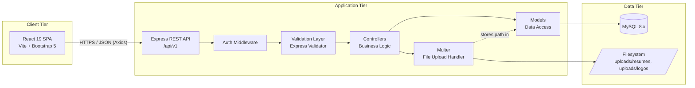

**Key architectural principles:**

- **Separation of concerns:** The client only renders UI and manages presentation state; all business rules, authorization, and data integrity checks live on the server.
- **Statelessness:** Authentication state is carried entirely in the JWT; the server does not persist sessions.
- **Single source of truth for data:** MySQL is the only persistent store for structured data; the filesystem stores only binary file content (resumes, logos), referenced by path/URL in MySQL — never as blobs.
- **Environment-driven configuration:** Database credentials, JWT secrets, upload limits, and CORS origins are all supplied via `.env`, never hardcoded, enabling promotion across dev/staging/production without code changes.
- **Layered backend:** Requests flow through a fixed pipeline — routing → authentication → authorization → validation → controller (business logic) → model (data access) — so each concern can be tested, replaced, or extended independently.

---

## 2. Frontend Architecture

The frontend is a **component-based, role-aware React SPA**. It is organized around four architectural layers:

1. **Pages** — route-level containers that compose components and orchestrate data fetching for a specific URL.
2. **Components** — reusable, presentation-focused UI building blocks, further subdivided by role (`common`, `student`, `company`, `admin`).
3. **Services** — the Axios abstraction layer; all HTTP calls to the backend are funneled through here, never called directly from components.
4. **Context** — global state that must be shared across the component tree (primarily authentication state).

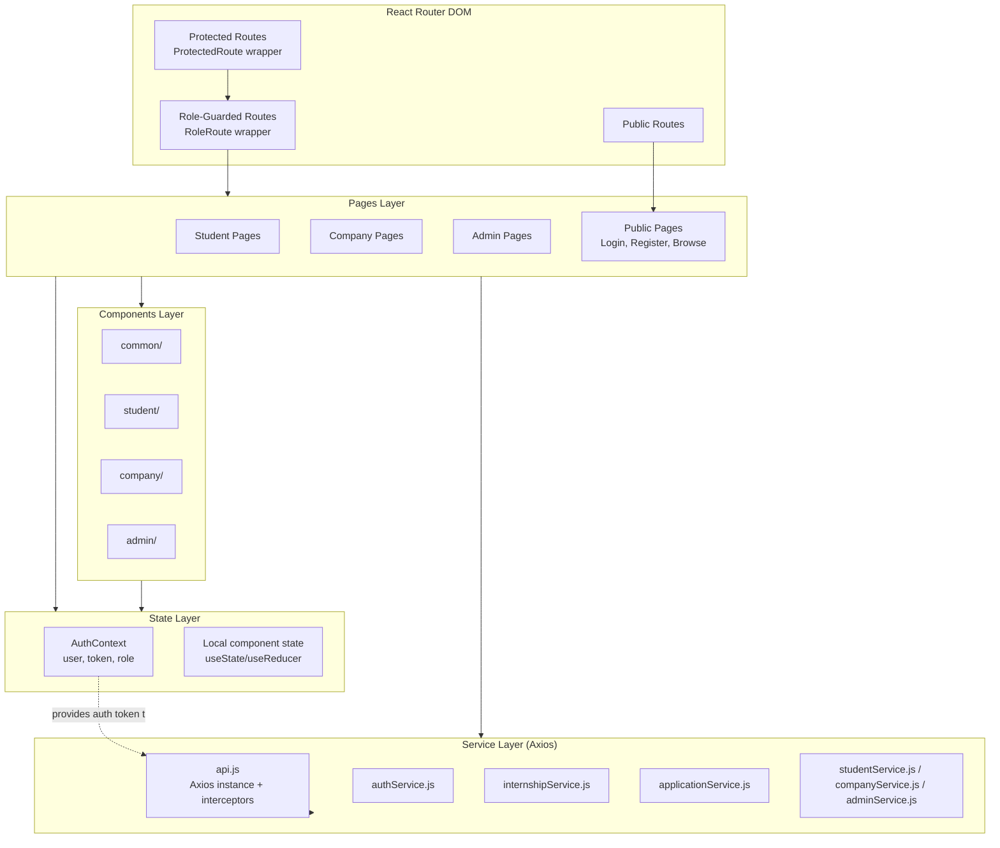

**Design decisions:**

- **Context API over Redux:** Given the app's primary global concern is authentication (current user, role, token), React's Context API is sufficient and avoids the boilerplate of a full state-management library, consistent with the "prefer maintainability over short code, but don't over-engineer" spirit of the project.
- **Role-based rendering:** Components under `components/student`, `components/company`, and `components/admin` are only ever rendered inside routes already guarded for that role, so they can safely assume the shape of `AuthContext`'s user object.
- **Axios service layer:** Every API call is expressed as a named function in `services/`, keeping components free of URL strings, headers, and error-parsing logic. A single Axios instance carries a request interceptor (attaches `Authorization: Bearer <token>`) and a response interceptor (normalizes errors and handles `401` globally).
- **Bootstrap-only styling:** No CSS-in-JS or utility framework beyond Bootstrap 5; custom styling is limited to small overrides in scoped CSS files, per the design constraint in the SRS.

---

## 3. Backend Architecture

The backend is a **layered Express application** following strict MVC separation. Each incoming request passes through a well-defined pipeline before reaching business logic, and each layer has a single responsibility:

```mermaid
flowchart TD
    Req[Incoming HTTP Request] --> CORS[CORS Middleware]
    CORS --> BodyParser[Body Parser / JSON]
    BodyParser --> Router[Route Matching<br/>routes/*.js]
    Router --> Auth{Protected Route?}
    Auth -- Yes --> Authenticate[authenticate middleware<br/>verify JWT]
    Auth -- No --> Validate
    Authenticate --> Authorize[authorize(...roles) middleware<br/>RBAC check]
    Authorize --> Validate[Validation middleware<br/>Express Validator schemas]
    Validate --> Controller[Controller<br/>business logic orchestration]
    Controller --> Model[Model<br/>parameterized SQL queries]
    Model --> DB[(MySQL)]
    Controller --> Response[Standard Response Envelope]
    Response --> Client[Client]
    Validate -. validation failure .-> ErrorHandler
    Authenticate -. invalid/expired token .-> ErrorHandler
    Authorize -. insufficient role .-> ErrorHandler
    Controller -. thrown/async error .-> ErrorHandler[Centralized Error Handler]
    ErrorHandler --> Response
```

**Layer responsibilities:**

| Layer | Responsibility | Must Not Do |
|-------|----------------|--------------|
| **Routes** | Map HTTP method + path to a controller function; attach middleware chain. | Contain business logic. |
| **Middleware** | Cross-cutting concerns: auth, RBAC, validation, error handling, file upload. | Access the database directly. |
| **Controllers** | Orchestrate a single use case: call validators' results, invoke models, shape the response. | Contain raw SQL. |
| **Models** | Encapsulate all SQL access for one entity via parameterized queries. | Format HTTP responses. |
| **Utils** | Stateless helper functions (token signing, response formatting, pagination math). | Hold request/response objects. |
| **Validators** | Express Validator schemas per endpoint. | Perform database lookups beyond uniqueness checks where unavoidable. |

All controller functions are `async` and are wrapped (directly or via an `asyncHandler` utility) so that rejected promises are forwarded to the centralized error-handling middleware rather than crashing the process or being silently swallowed.

---

## 4. MVC Structure

The backend strictly separates **Model**, **View** (represented here by the JSON response envelope, since there is no server-rendered view), and **Controller**, with additional supporting layers required by a production API (middleware, validators, utils) that sit alongside the classic MVC triad.

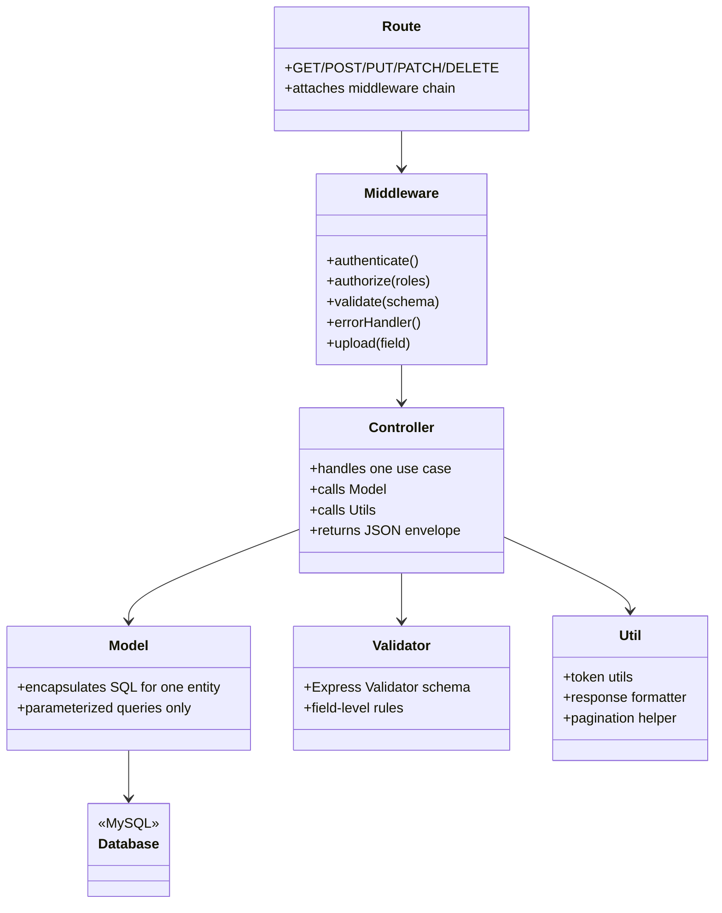

**Mapping to resources:** Every core resource identified in the Database Design document (`users` and its role profiles, `internships`, `applications`, `saved_internships`, `notifications`) gets its own route file, controller file, and model file, e.g. `internship.routes.js` → `internship.controller.js` → `internship.model.js`. This 1:1:1 mapping keeps the codebase predictable and easy to navigate as it grows.

---

## 5. Folder Structure

The folder structure below extends the structure already defined in `docs/00_Project_Overview.md`, adding the detail needed to support every module described in the SRS and API Design documents.

```
internship-management-portal/
│
├── client/                                # React frontend (Vite)
│   ├── public/
│   ├── src/
│   │   ├── assets/                        # Images, icons, static assets
│   │   ├── components/
│   │   │   ├── common/                    # Navbar, Footer, Button, Pagination,
│   │   │   │                              # ProtectedRoute, RoleRoute, Loader,
│   │   │   │                              # AlertMessage, FormInput, Modal
│   │   │   ├── student/                   # ProfileForm, ResumeUpload,
│   │   │   │                              # InternshipCard, ApplicationStatusBadge
│   │   │   ├── company/                   # PostingForm, ApplicantTable,
│   │   │   │                              # CompanyProfileForm
│   │   │   └── admin/                     # UserTable, CompanyApprovalCard,
│   │   │                                  # ModerationPanel, StatsCard
│   │   ├── context/
│   │   │   └── AuthContext.jsx            # Auth state, login/logout, token persistence
│   │   ├── pages/
│   │   │   ├── auth/                      # Login.jsx, Register.jsx
│   │   │   ├── student/                   # Dashboard, BrowseInternships,
│   │   │   │                              # InternshipDetails, MyApplications, Profile
│   │   │   ├── company/                   # Dashboard, ManagePostings,
│   │   │   │                              # PostingApplicants, CompanyProfile
│   │   │   ├── admin/                     # Dashboard, ManageUsers,
│   │   │   │                              # PendingCompanies, ModeratePostings, AuditLogs
│   │   │   └── shared/                    # NotFound, Unauthorized, Notifications
│   │   ├── routes/
│   │   │   └── AppRoutes.jsx              # Central React Router configuration
│   │   ├── services/
│   │   │   ├── api.js                     # Axios instance + interceptors
│   │   │   ├── authService.js
│   │   │   ├── studentService.js
│   │   │   ├── companyService.js
│   │   │   ├── internshipService.js
│   │   │   ├── applicationService.js
│   │   │   ├── notificationService.js
│   │   │   └── adminService.js
│   │   ├── utils/                         # formatDate, validators, constants
│   │   ├── App.jsx
│   │   └── main.jsx
│   ├── .env.example
│   └── package.json
│
├── server/                                # Node.js/Express backend
│   ├── config/
│   │   ├── db.js                          # MySQL connection pool
│   │   └── env.js                         # Centralized env variable loader/validator
│   ├── controllers/
│   │   ├── auth.controller.js
│   │   ├── student.controller.js
│   │   ├── company.controller.js
│   │   ├── internship.controller.js
│   │   ├── application.controller.js
│   │   ├── savedInternship.controller.js
│   │   ├── notification.controller.js
│   │   ├── admin.controller.js
│   │   └── analytics.controller.js
│   ├── middleware/
│   │   ├── authenticate.js                # JWT verification
│   │   ├── authorize.js                   # Role-based access control
│   │   ├── validateRequest.js             # Express Validator result handler
│   │   ├── upload.js                      # Multer configuration (resumes/logos)
│   │   └── errorHandler.js                # Centralized error-handling middleware
│   ├── models/
│   │   ├── user.model.js
│   │   ├── studentProfile.model.js
│   │   ├── companyProfile.model.js
│   │   ├── internship.model.js
│   │   ├── application.model.js
│   │   ├── savedInternship.model.js
│   │   ├── notification.model.js
│   │   └── auditLog.model.js
│   ├── routes/
│   │   ├── auth.routes.js
│   │   ├── student.routes.js
│   │   ├── company.routes.js
│   │   ├── internship.routes.js
│   │   ├── application.routes.js
│   │   ├── savedInternship.routes.js
│   │   ├── notification.routes.js
│   │   ├── admin.routes.js
│   │   ├── analytics.routes.js
│   │   └── index.js                       # Mounts all routers under /api/v1
│   ├── utils/
│   │   ├── generateToken.js
│   │   ├── responseFormatter.js
│   │   ├── pagination.js
│   │   └── asyncHandler.js
│   ├── validators/
│   │   ├── auth.validator.js
│   │   ├── internship.validator.js
│   │   ├── application.validator.js
│   │   └── admin.validator.js
│   ├── uploads/
│   │   ├── resumes/
│   │   └── logos/
│   ├── app.js                             # Express app setup (middleware, routes)
│   ├── server.js                          # HTTP server bootstrap
│   ├── .env.example
│   └── package.json
│
├── docs/
│   ├── 00_Project_Overview.md
│   ├── 01_Software_Requirements_Specification.md
│   ├── 02_Database_Design.md
│   ├── 03_API_Design.md
│   └── 04_Project_Architecture.md
│
├── .gitignore
└── README.md
```

---

## 6. Authentication Flow

Authentication uses **JWT issued at login/registration**, verified on every protected request. Per the API Design document, only Students and Companies self-register; Admin accounts are provisioned separately and only ever authenticate via `/auth/login`.

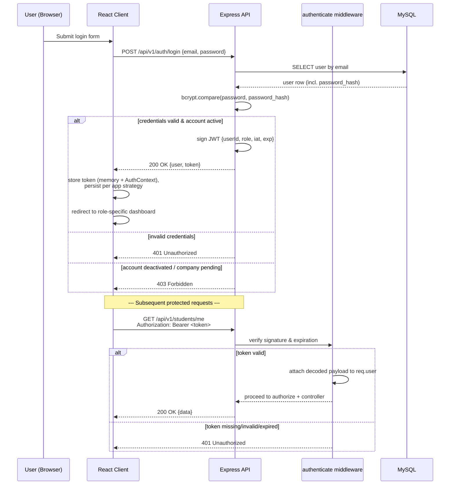

**Notes:**

- Passwords are never returned in any API response; models explicitly enumerate safe columns rather than using `SELECT *`.
- The JWT payload is intentionally minimal (`userId`, `role`, `iat`, `exp`) — no PII beyond what's needed for authorization decisions, per FR-AUTH-03 and the database's security considerations.
- Logout is a client-side operation (discarding the token); the `/auth/logout` endpoint exists as a placeholder for future token-blacklisting.

---

## 7. Authorization Flow

Authorization is enforced in two layers on every protected route: **authentication** (is this a valid user?) followed by **role-based access control** (is this user allowed to perform this action?), and in several endpoints, a third layer of **ownership checks** (is this user allowed to act on this specific resource?).

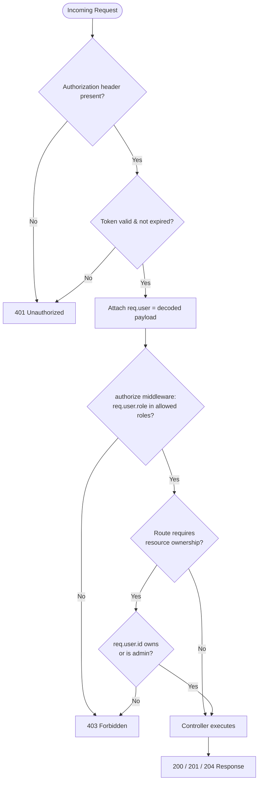

**Examples of ownership checks derived from the SRS/API Design:**

| Scenario | Rule |
|----------|------|
| Editing an internship posting | Company must own the posting (`internships.company_id` matches `req.user.id`'s company profile), or the requester is an Admin. |
| Viewing a resume | Company may view resumes only of students who applied to *its own* postings; Admin may view any. |
| Updating application status | Only the company that owns the internship, or an Admin, may transition an application's status. |
| Deleting a notification | Only the notification's owning user may delete it. |

This mirrors the Appendix "Role Access Summary" table in `docs/03_API_Design.md`, which is treated as the authoritative source for which roles may access which endpoint groups.

---

## 8. API Communication Flow

The client communicates with the server exclusively through the versioned REST API (`/api/v1`) using JSON over HTTPS, via a centralized Axios service layer.

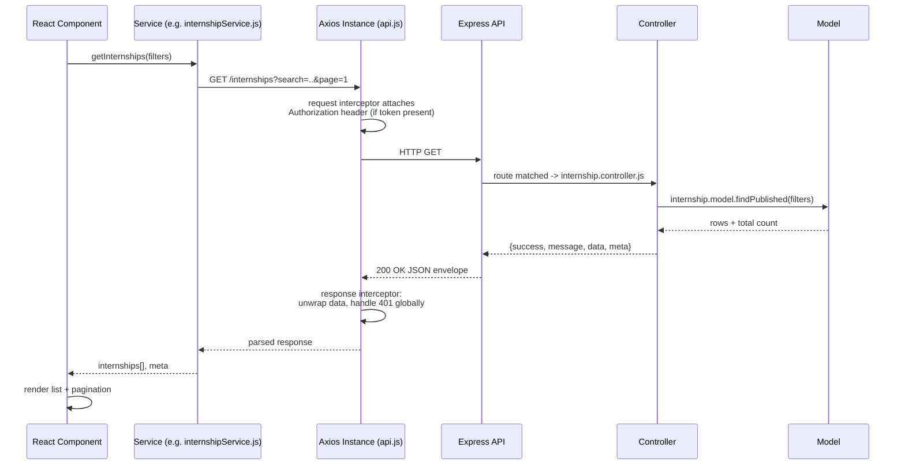

**Conventions carried over from the API Design document:**

- All responses use the standard envelope (`success`, `message`, `data`, optional `meta`); the Axios response interceptor is the single place that understands this shape, so components only ever deal with plain data.
- A single response interceptor handles global `401` responses (e.g., expired token) by clearing `AuthContext` and redirecting to `/login`, so individual components do not need to repeat this logic.
- List requests always pass `page`/`limit`/`sort`/filter fields as query parameters; write requests pass a JSON body; file-upload requests use `multipart/form-data` and a dedicated Axios call without the default `Content-Type: application/json` header.

---

## 9. Database Communication Flow

All database access is confined to the **Model layer**, using a MySQL connection pool (via `config/db.js`) and parameterized queries exclusively — never string concatenation — to prevent SQL injection, per FR-7 and the database security considerations.

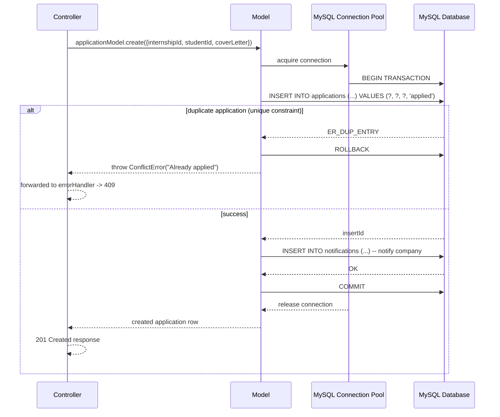

**Principles:**

- **Connection pooling:** A single pool (sized via an environment variable) is created at startup in `config/db.js` and reused across requests; connections are always released back to the pool, including in `catch` blocks.
- **Transactions for multi-step writes:** Any operation that must update more than one table atomically (e.g., updating an application's status *and* creating a notification, or approving a company *and* recording an audit-log entry) is wrapped in an explicit transaction (`BEGIN` / `COMMIT` / `ROLLBACK`), per the database design document's best practices.
- **Foreign keys as a second line of defense:** Even though the application layer checks relationships before writing (e.g., verifying the internship exists before creating an application), database-level foreign keys and unique constraints (such as `uq_applications_internship_student`) guard against race conditions.
- **Explicit column selection:** Models never use `SELECT *`; sensitive columns such as `password_hash` are excluded at the query level so they can never leak into an API response by omission.

---

## 10. File Upload Flow

File uploads (student resumes, company logos) are handled by **Multer** middleware, mounted only on the specific routes that accept files, with strict type and size validation before anything touches the filesystem.

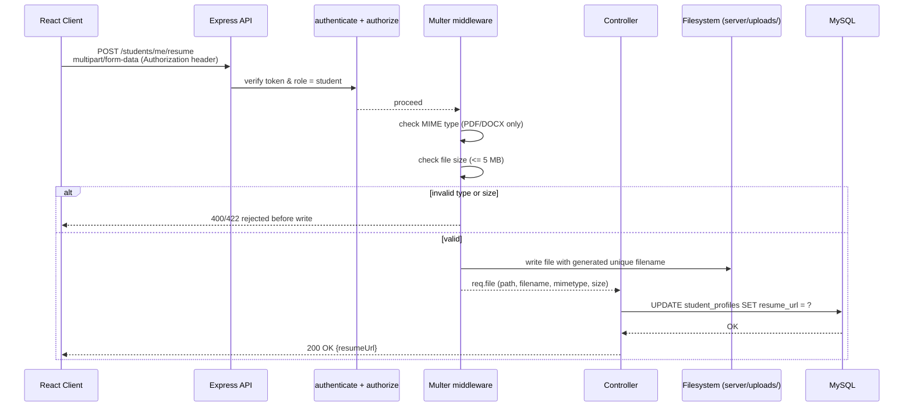

**Rules enforced (per FR-RES-01 through FR-RES-05):**

- Only PDF/DOCX MIME types are accepted for resumes; validation checks the actual MIME type, not just the file extension.
- Uploaded files are stored under `server/uploads/resumes/` and `server/uploads/logos/` with **unique, non-guessable filenames** (e.g., a UUID or hash-based name), never the original client-supplied filename, to avoid collisions and prevent path-based guessing.
- The `uploads/` directory is served, if at all, through a controlled static route or a signed-URL-style endpoint — never as a fully open static mount — so that access to resumes can be gated by ownership rules (a company may only fetch resumes of students who applied to its own postings).
- The database never stores binary content; it stores only the resulting relative path/URL (`resume_url`, `logo_url`), keeping MySQL lean, per the database design document.
- The upload directory structure is abstracted behind the Model/Controller layer so it can be swapped for cloud object storage (e.g., S3-compatible) in the future without changing calling code, per the SRS's forward-looking design constraint.

---

## 11. React Component Hierarchy

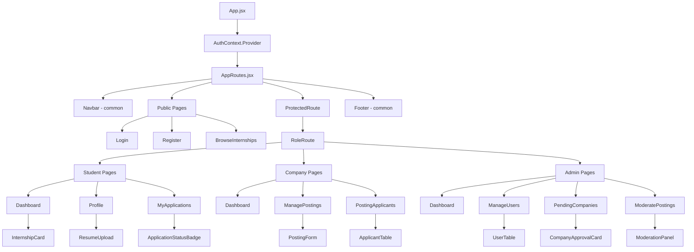

**Principles:**

- **Pages own data fetching**, calling the appropriate service and passing data down as props; **components under `components/`** remain presentational and reusable, accepting data and callbacks via props rather than fetching data themselves.
- **`common/` components** (Navbar, Pagination, Modal, FormInput, AlertMessage, Loader, ProtectedRoute, RoleRoute) have no role-specific knowledge and are shared across all three dashboards.
- **`ProtectedRoute`** checks only "is the user authenticated"; **`RoleRoute`** additionally checks "is the user's role one of the allowed roles for this branch," redirecting to an `Unauthorized` page otherwise. This mirrors the two-layer authorization enforced on the backend.

---

## 12. State Management

State is deliberately split into three scopes, avoiding a heavier state-management library since the app's cross-cutting state surface is small:

| Scope | Mechanism | Examples |
|-------|-----------|----------|
| **Global/auth state** | `AuthContext` (Context API + `useReducer`) | Current user, role, token, `isAuthenticated`, login/logout actions |
| **Page-level server state** | Local `useState`/`useEffect` inside page components, populated via service calls | Internship list + pagination meta, applicant list, notifications |
| **Local UI state** | `useState` inside components | Form field values, modal open/close, filter panel toggles, table sort column |

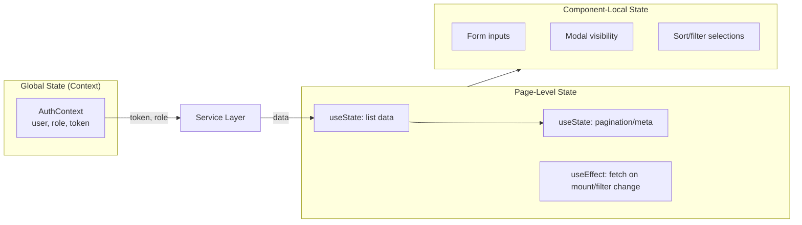

**Rules:**

- `AuthContext` is the *only* piece of state accessible application-wide; everything else is scoped to the page or component that owns it, preventing prop-drilling from becoming a justification for global state sprawl.
- Server data (internship lists, applicant tables, notifications) is treated as **derived, re-fetchable state**, not cached indefinitely — pages re-fetch on mount and whenever their filter/pagination dependencies change, keeping the client's view consistent with the server's source of truth.
- Optimistic UI updates are avoided for status-changing actions (e.g., approving a company, updating application status); the UI updates only after a confirmed success response, favoring consistency over perceived speed, consistent with the "avoid partial writes" reliability requirement.

---

## 13. Error Handling Strategy

Error handling follows a single, predictable contract end-to-end: **every failure, on both client and server, resolves into the same JSON error envelope** defined in the API Design document, and the client has one place that knows how to render it.

### Backend

```mermaid
flowchart TD
    Thrown[Error thrown or async rejection<br/>anywhere in the request lifecycle] --> Next[next(error) via asyncHandler]
    Next --> EH[Centralized errorHandler middleware]
    EH --> Classify{Error type?}
    Classify -- Validation --> V[422 Unprocessable Entity<br/>errors: field-level array]
    Classify -- Auth token issue --> A[401 Unauthorized]
    Classify -- Role/ownership issue --> R[403 Forbidden]
    Classify -- Not found --> N[404 Not Found]
    Classify -- Conflict (duplicate) --> C[409 Conflict]
    Classify -- Unexpected --> U[500 Internal Server Error<br/>generic message, no stack trace exposed]
    V --> Envelope[Standard error envelope]
    A --> Envelope
    R --> Envelope
    N --> Envelope
    C --> Envelope
    U --> Envelope
    Envelope --> Log[Log full error server-side<br/>Winston/console per environment]
    Envelope --> Client[Sent to client]
```

- All controller `async` functions are wrapped so that thrown errors and rejected promises are funneled to `next(error)` rather than crashing the process.
- The centralized error-handling middleware is the **only** place that maps internal error types to HTTP status codes and the response envelope, guaranteeing the consistency required by Acceptance Criteria in the SRS ("All API error responses follow a consistent structure").
- In production, internal error details (stack traces, SQL error text) are never sent to the client; they are logged server-side only. In development, additional detail may be included behind an environment flag.

### Frontend

- The Axios response interceptor is the single funnel for all API errors: it normalizes the error envelope into a consistent shape (`{ message, errors, status }`) before it ever reaches a component.
- Field-level validation errors (`errors` array) are mapped onto the corresponding form fields; general errors (`404`, `409`, `500`) are surfaced via a shared `AlertMessage`/toast component.
- A global `401` response clears `AuthContext` and redirects to `/login`, so components do not need to special-case expired sessions individually.
- A top-level React Error Boundary catches unexpected rendering exceptions and displays a graceful fallback UI rather than a blank/broken page.

---

## 14. Security Architecture

Security is enforced in depth, across the network, application, and data layers, directly reflecting the Security sections of the Project Overview, SRS, and Database Design documents.

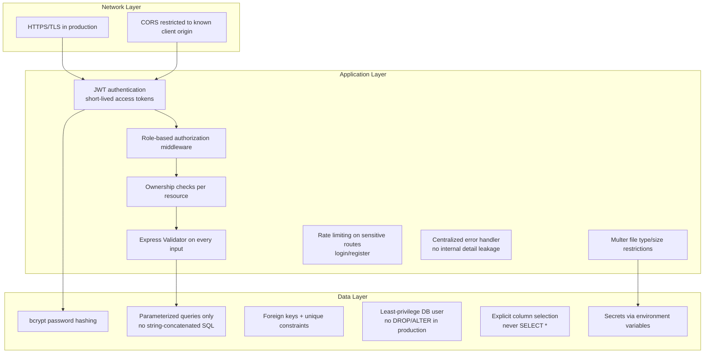

**Controls mapped to requirements:**

| Control | Requirement Reference |
|---------|------------------------|
| Passwords hashed with bcrypt, never logged or returned in responses | FR-AUTH-02, DB Security Considerations |
| JWT with `userId` + `role` only, defined expiration | FR-AUTH-03, NFR 4.2 |
| `authenticate` + `authorize(...roles)` middleware on every protected route | FR-AUTH-04, FR-3 |
| Server-side validation on all inputs via Express Validator, regardless of client-side checks | FR-7, Design Constraint 2.5 |
| File type/size validation via Multer, unique non-guessable filenames | FR-RES-01–04 |
| Parameterized queries exclusively | Design Constraint 2.5, DB Security Considerations |
| Foreign keys with `ON DELETE`/`ON UPDATE` rules | Database Design §6 |
| Consistent, detail-free error responses in production | FR-12, NFR 4.5 |
| Environment-variable-based configuration for all secrets | NFR "Portability", DB Security Considerations |
| HTTPS enforced in production | NFR 4.2 |

---

## 15. Deployment Architecture

The system is designed to be deployed as **two independently deployable artifacts** — a static frontend build and a Node.js API service — sitting in front of a managed MySQL instance, with clear environment separation (development, staging, production) driven entirely by environment variables.

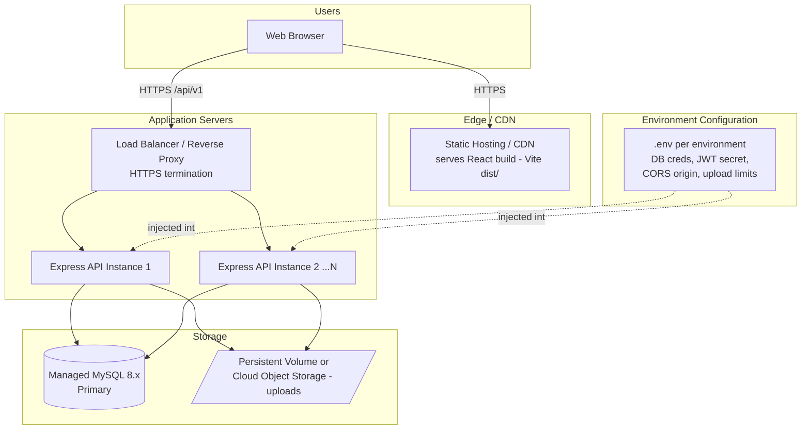

**Deployment principles:**

- **Stateless API instances:** Because authentication is JWT-based and no in-memory session state is kept, any number of API instances can run behind the load balancer interchangeably; scaling out is a matter of adding instances, not re-architecting.
- **Separate build/deploy pipelines:** The React app is built via Vite into static assets and served from a CDN/static host, decoupled from the API's release cycle; the Express API is deployed as its own Node.js service.
- **Environment parity:** Development, staging, and production differ only by the contents of their respective `.env` files (DB host/credentials, JWT secret, CORS-allowed origin, upload size limits) — never by code branches or hardcoded values.
- **Shared file storage across instances:** Because uploads (resumes, logos) must be readable by whichever API instance serves a later request, file storage is either a shared persistent volume or, preferably at scale, migrated to cloud object storage (e.g., S3-compatible), consistent with the future-enhancement noted in the Database Design document.
- **Database as a managed, separately-scaled service:** MySQL runs as its own managed instance (or primary/replica setup at scale), decoupled from application server lifecycle, with TLS-encrypted connections and least-privilege application credentials.
- **CORS locked down:** In production, the API's CORS configuration allows only the deployed frontend's origin, not `*`, reducing cross-origin attack surface.

---

*End of Document — 04_Project_Architecture.md*
