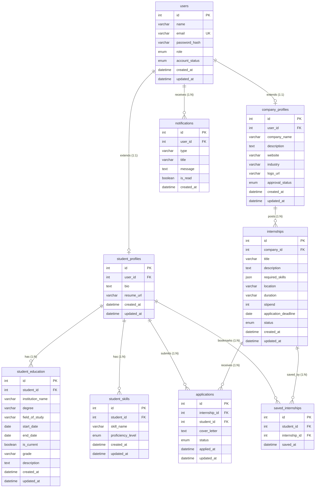
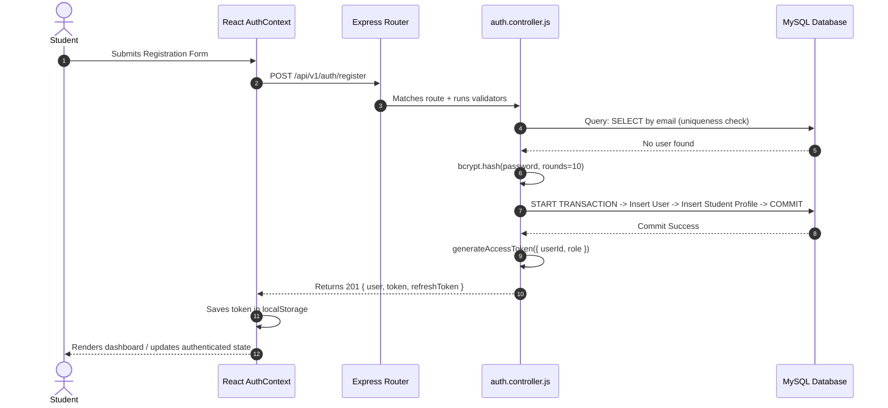
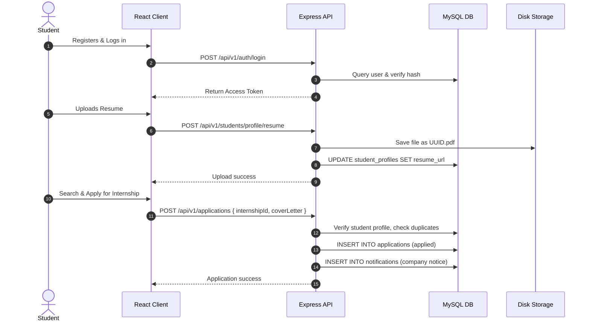
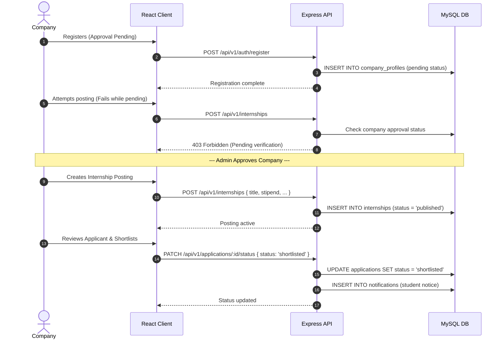
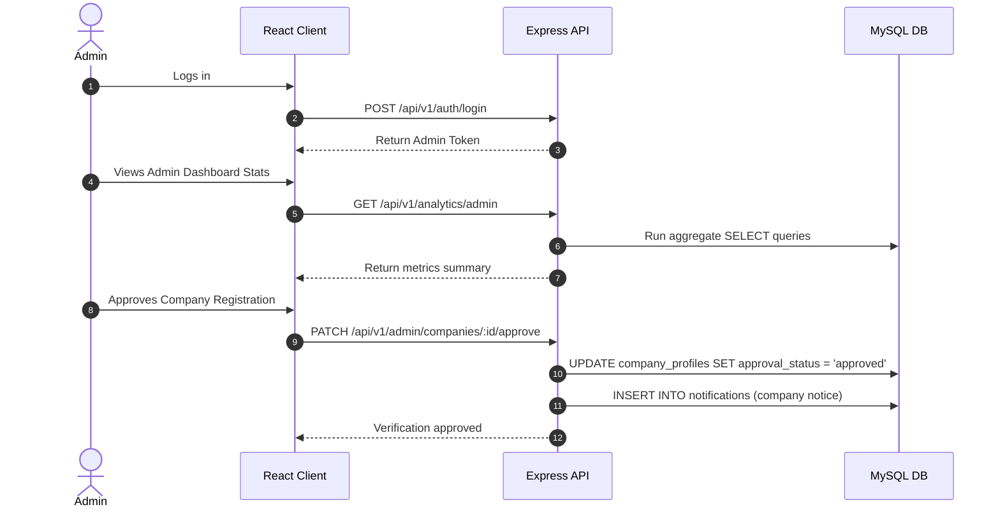

# Internship Management Portal: Complete Project Explanation & System Architecture

This document provides a comprehensive technical overview and architecture explanation of the Internship Management Portal. It is structured as a study guide for interviews, system walkthroughs, and portfolio presentations.

---

## 1. Project Overview

### Purpose
The **Internship Management Portal** is a centralized, role-based platform designed to connect students with companies offering early-career opportunities, moderated by site administrators. It replaces manual, error-prone tracking systems (such as spreadsheets and emails) with a secure, automated web application that manages the entire internship lifecycle.

### Core Features Implemented
*   **Students:** Self-registration, multi-step profile builder (education and skills CRUD), resume upload (PDF/DOCX), keyword search with multi-field filtering, bookmarking internships, single-click application with cover letters, application status tracking, and in-app notifications.
*   **Companies:** Self-registration (requires admin approval), profile management (logo upload), full internship posting CRUD (draft, publish, close, remove), and applicant evaluation panel (review resumes, update status to Shortlist, Accept, or Reject).
*   **Administrators:** Complete user account moderation (deactivate/reactivate), company verification workflow, internship listing moderation (flag/remove), and platform statistics dashboard.

### User Roles & Permissions
1.  **Student:** Seeks and applies for internships.
2.  **Company:** Posts positions and hires talent. Can only publish postings once approved by an Admin.
3.  **Admin:** Oversees security, verifies companies, and moderates content.

### High-Level Architecture
The system is built as a **three-tier client-server application**:
*   **Client Tier:** React 19 Single Page Application (SPA) bundled via Vite. Styled with modern Bootstrap 5 for responsiveness.
*   **Application Tier:** Stateless REST API built with Node.js and Express.js. It handles routing, authorization, input validation, and media upload.
*   **Data Tier:** MySQL 8.x database. MySQL InnoDB engine is used to enforce foreign key constraints, index lookups, and transactional integrity. Files are stored on the local filesystem, with their relative paths recorded in the database.

---

## 2. Folder Structure

The workspace is organized into a clean mono-repo structure separating the frontend (`client`) and backend (`server`) logic:

### Frontend (`client/src/`)
*   [components/](file:///d:/project-fsd/internship-management-portal-fixed/internship-management-portal/client/src/components) — Reusable UI modules, split into:
    *   `common/`: Global shell elements like the [Navbar](file:///d:/project-fsd/internship-management-portal-fixed/internship-management-portal/client/src/components/common/Navbar.jsx), [Footer](file:///d:/project-fsd/internship-management-portal-fixed/internship-management-portal/client/src/components/common/Footer.jsx), [ProtectedRoute](file:///d:/project-fsd/internship-management-portal-fixed/internship-management-portal/client/src/components/common/ProtectedRoute.jsx), and [RoleRoute](file:///d:/project-fsd/internship-management-portal-fixed/internship-management-portal/client/src/components/common/RoleRoute.jsx).
    *   `student/`: [InternshipCard](file:///d:/project-fsd/internship-management-portal-fixed/internship-management-portal/client/src/components/student/InternshipCard.jsx), [InternshipDetails](file:///d:/project-fsd/internship-management-portal-fixed/internship-management-portal/client/src/components/student/InternshipDetails.jsx), and filters.
    *   `company/`: Form components for postings and applicants.
*   [pages/](file:///d:/project-fsd/internship-management-portal-fixed/internship-management-portal/client/src/pages) — Route-level container components that coordinate data fetching and layout:
    *   `auth/`: Login and Register forms.
    *   `student/` / `company/` / `admin/`: Role-specific dashboard pages.
    *   `shared/`: NotFound, Unauthorized, and Notifications views.
*   [services/](file:///d:/project-fsd/internship-management-portal-fixed/internship-management-portal/client/src/services) — Axios abstraction layer. Contains the base instance configuration [api.js](file:///d:/project-fsd/internship-management-portal-fixed/internship-management-portal/client/src/services/api.js) (attaches JWT headers and handles global 401s) and modular API wrappers (e.g., [authService.js](file:///d:/project-fsd/internship-management-portal-fixed/internship-management-portal/client/src/services/authService.js), [studentService.js](file:///d:/project-fsd/internship-management-portal-fixed/internship-management-portal/client/src/services/studentService.js)).
*   [context/](file:///d:/project-fsd/internship-management-portal-fixed/internship-management-portal/client/src/context) — Global React state containers. The [AuthContext.jsx](file:///d:/project-fsd/internship-management-portal-fixed/internship-management-portal/client/src/context/AuthContext.jsx) manages user login state, token persistence, and registration.
*   [routes/](file:///d:/project-fsd/internship-management-portal-fixed/internship-management-portal/client/src/routes) — Contains [AppRoutes.jsx](file:///d:/project-fsd/internship-management-portal-fixed/internship-management-portal/client/src/routes/AppRoutes.jsx) to map URLs to corresponding pages under role access control wrappers.
*   [assets/](file:///d:/project-fsd/internship-management-portal-fixed/internship-management-portal/client/src/assets) — Static assets like styling overrides.
*   [utils/](file:///d:/project-fsd/internship-management-portal-fixed/internship-management-portal/client/src/utils) — Shared helper functions, such as [fileUrl.js](file:///d:/project-fsd/internship-management-portal-fixed/internship-management-portal/client/src/utils/fileUrl.js) for formatting uploaded file paths.

### Backend (`server/`)
*   [routes/](file:///d:/project-fsd/internship-management-portal-fixed/internship-management-portal/server/routes) — Express routers defining the endpoint paths (e.g., [auth.routes.js](file:///d:/project-fsd/internship-management-portal-fixed/internship-management-portal/server/routes/auth.routes.js), [internship.routes.js](file:///d:/project-fsd/internship-management-portal-fixed/internship-management-portal/server/routes/internship.routes.js)) and linking validators, middlewares, and controllers.
*   [controllers/](file:///d:/project-fsd/internship-management-portal-fixed/internship-management-portal/server/controllers) — Orchestrators of business logic. They read validated requests, invoke database queries from models, and return standardized JSON envelopes.
*   [models/](file:///d:/project-fsd/internship-management-portal-fixed/internship-management-portal/server/models) — Contains parameterized SQL query classes/modules (e.g., [user.model.js](file:///d:/project-fsd/internship-management-portal-fixed/internship-management-portal/server/models/user.model.js)). All direct database interaction is localized here.
*   [middleware/](file:///d:/project-fsd/internship-management-portal-fixed/internship-management-portal/server/middleware) — Intercepts incoming requests. Contains token verification [authenticate.js](file:///d:/project-fsd/internship-management-portal-fixed/internship-management-portal/server/middleware/authenticate.js), role evaluation [authorize.js](file:///d:/project-fsd/internship-management-portal-fixed/internship-management-portal/server/middleware/authorize.js), Multer setup [upload.js](file:///d:/project-fsd/internship-management-portal-fixed/internship-management-portal/server/middleware/upload.js), and the centralized [errorHandler.js](file:///d:/project-fsd/internship-management-portal-fixed/internship-management-portal/server/middleware/errorHandler.js).
*   [validators/](file:///d:/project-fsd/internship-management-portal-fixed/internship-management-portal/server/validators) — Implements `express-validator` schema definitions to validate payload contents.
*   [config/](file:///d:/project-fsd/internship-management-portal-fixed/internship-management-portal/server/config) — Environment loader [env.js](file:///d:/project-fsd/internship-management-portal-fixed/internship-management-portal/server/config/env.js) and database connection pooler [db.js](file:///d:/project-fsd/internship-management-portal-fixed/internship-management-portal/server/config/db.js).
*   [uploads/](file:///d:/project-fsd/internship-management-portal-fixed/internship-management-portal/server/uploads) — The target location for uploaded student resumes (`/resumes`) and company logos (`/logos`).
*   [utils/](file:///d:/project-fsd/internship-management-portal-fixed/internship-management-portal/server/utils) — Utility modules such as `asyncHandler`, `apiError`, and `apiResponse` for standardized operational structures.

---

## 3. Database Design

The database schema is normalized to **Third Normal Form (3NF)** and contains **9 tables**. Multi-valued attributes (like student education and skills) are normalized into dedicated child tables to support independent CRUD operations.



### Table Breakdown

#### 1. `users`
*   **Purpose:** Core identity registry for authentication.
*   **Columns:** `id` (PK, Auto-Increment), `name` (VARCHAR 100), `email` (VARCHAR 191, Unique Index), `password_hash` (VARCHAR 255), `role` (ENUM: 'student', 'company', 'admin'), `account_status` (ENUM: 'active', 'deactivated', Default 'active'), `created_at`, `updated_at`.

#### 2. `student_profiles`
*   **Purpose:** Contains profile links extending a student user's identity.
*   **Columns:** `id` (PK), `user_id` (FK to `users.id`, Unique Constraint), `bio` (TEXT), `resume_url` (VARCHAR 255), `created_at`, `updated_at`.
*   **Cascades:** `ON DELETE CASCADE` from `users`.

#### 3. `student_education`
*   **Purpose:** Captures independent educational credentials for students.
*   **Columns:** `id` (PK), `student_id` (FK to `student_profiles.id`), `institution_name` (VARCHAR 200), `degree` (VARCHAR 150), `field_of_study` (VARCHAR 150), `start_date` (DATE), `end_date` (DATE), `is_current` (BOOLEAN), `grade` (VARCHAR 50), `description` (TEXT), `created_at`, `updated_at`.
*   **Cascades:** `ON DELETE CASCADE` from `student_profiles`.

#### 4. `student_skills`
*   **Purpose:** Lists discrete student skill proficiencies.
*   **Columns:** `id` (PK), `student_id` (FK to `student_profiles.id`), `skill_name` (VARCHAR 100), `proficiency_level` (ENUM: 'beginner', 'intermediate', 'advanced', 'expert'), `created_at`, `updated_at`.
*   **Unique Index:** `uq_student_skills_student_skill` on (`student_id`, `skill_name`) prevents duplicate entries.
*   **Cascades:** `ON DELETE CASCADE` from `student_profiles`.

#### 5. `company_profiles`
*   **Purpose:** Extends company user information with verification status.
*   **Columns:** `id` (PK), `user_id` (FK to `users.id`, Unique Constraint), `company_name` (VARCHAR 150), `description` (TEXT), `website` (VARCHAR 255), `industry` (VARCHAR 100), `logo_url` (VARCHAR 255), `approval_status` (ENUM: 'pending', 'approved', 'rejected', Default 'pending'), `created_at`, `updated_at`.
*   **Cascades:** `ON DELETE CASCADE` from `users`.

#### 6. `internships`
*   **Purpose:** Details of internship postings created by companies.
*   **Columns:** `id` (PK), `company_id` (FK to `company_profiles.id`), `title` (VARCHAR 150), `description` (TEXT), `required_skills` (JSON array of strings), `location` (VARCHAR 150), `duration` (VARCHAR 50), `stipend` (INT UNSIGNED), `application_deadline` (DATE), `status` (ENUM: 'draft', 'published', 'closed', 'flagged', 'removed', Default 'draft'), `created_at`, `updated_at`.
*   **Cascades:** `ON DELETE CASCADE` from `company_profiles`.

#### 7. `applications`
*   **Purpose:** Many-to-many junction record linking a student to their target internship.
*   **Columns:** `id` (PK), `internship_id` (FK to `internships.id`), `student_id` (FK to `student_profiles.id`), `cover_letter` (TEXT), `status` (ENUM: 'applied', 'under_review', 'shortlisted', 'accepted', 'rejected', 'withdrawn', Default 'applied'), `applied_at`, `updated_at`.
*   **Unique Index:** `uq_applications_internship_student` on (`internship_id`, `student_id`) prevents double-applying.
*   **Cascades:** `ON DELETE CASCADE` from both `internships` and `student_profiles`.

#### 8. `saved_internships`
*   **Purpose:** Many-to-many junction mapping bookmarked internships for students.
*   **Columns:** `id` (PK), `student_id` (FK to `student_profiles.id`), `internship_id` (FK to `internships.id`), `saved_at`.
*   **Unique Index:** `uq_saved_student_internship` on (`student_id`, `internship_id`).
*   **Cascades:** `ON DELETE CASCADE` from both `student_profiles` and `internships`.

#### 9. `notifications`
*   **Purpose:** In-app alert store targeting individual user IDs.
*   **Columns:** `id` (PK), `user_id` (FK to `users.id`), `type` (VARCHAR 50), `title` (VARCHAR 150), `message` (TEXT), `is_read` (BOOLEAN, Default FALSE), `created_at`.
*   **Cascades:** `ON DELETE CASCADE` from `users`.

---

## 4. Backend Flow

Let’s trace the request pipeline using the example of a **Student adding a Skill**:

```
[HTTP POST /api/v1/students/skills]
              ↓
  (Route Match: student.routes.js)
              ↓
   (authenticate Middleware) -- Validates JWT on Authorization header
              ↓
   (authorize('student'))    -- Asserts req.user.role === 'student'
              ↓
  (validateRequest Middleware) -- Checks express-validator rule outputs
              ↓
 (student.controller.js -> addSkill) -- Orchestrates controller logic
              ↓
  (studentSkill.model.js -> create)   -- Runs parameterized SQL query
              ↓
          [MySQL]           -- Inserts row, returns insertId
              ↓
(student.controller.js -> 201 Response) -- Returns standardized JSON envelope
```

### Source Code Details:
1.  **Route Match:** In [student.routes.js](file:///d:/project-fsd/internship-management-portal-fixed/internship-management-portal/server/routes/student.routes.js#L26), the endpoint is defined:
    ```javascript
    router.post('/skills', authenticate, authorize('student'), addSkillValidator, validateRequest, addSkill);
    ```
2.  **Authentication & Authorization:** The [authenticate.js](file:///d:/project-fsd/internship-management-portal-fixed/internship-management-portal/server/middleware/authenticate.js) middleware decodes the JWT and maps the payload to `req.user`. Then, [authorize.js](file:///d:/project-fsd/internship-management-portal-fixed/internship-management-portal/server/middleware/authorize.js) verifies that the user's role is authorized to access the endpoint.
3.  **Validation:** The `addSkillValidator` checks that the input contains a valid skill name and proficiency level. The helper [validateRequest.js](file:///d:/project-fsd/internship-management-portal-fixed/internship-management-portal/server/utils/validateRequest.js) checks for validation errors:
    ```javascript
    const errors = validationResult(req);
    if (!errors.isEmpty()) {
      return next(new UnprocessableEntityError('Validation failed', errors.array()));
    }
    ```
4.  **Controller Execution:** The controller in [student.controller.js](file:///d:/project-fsd/internship-management-portal-fixed/internship-management-portal/server/controllers/student.controller.js#L141-L157) queries the student profile ID:
    ```javascript
    const studentId = await studentProfileModel.findIdByUserId(req.user.userId);
    const existing = await studentSkillModel.existsByStudentAndName(studentId, skillName);
    if (existing) throw new ConflictError('Skill already added.');
    const skillId = await studentSkillModel.create(studentId, { skillName, proficiencyLevel });
    ```
5.  **Model execution:** The [studentSkill.model.js](file:///d:/project-fsd/internship-management-portal-fixed/internship-management-portal/server/models/studentSkill.model.js#L82-L89) executes a parameterized query against the connection pool:
    ```javascript
    const [result] = await pool.execute(
      `INSERT INTO student_skills (student_id, skill_name, proficiency_level) VALUES (?, ?, ?)`,
      [studentId, skillName, proficiencyLevel]
    );
    ```
6.  **Response Delivery:** The controller returns a success response using [apiResponse.js](file:///d:/project-fsd/internship-management-portal-fixed/internship-management-portal/server/utils/apiResponse.js#L18):
    ```javascript
    return sendSuccess(res, {
      statusCode: 201,
      message: 'Skill added successfully',
      data: newSkill,
    });
    ```

---

## 5. Frontend Flow

Let's trace how the UI updates when a **Student bookmarks/saves an Internship**:

```
 [User clicks "Save" button on InternshipDetails]
                       ↓
   [handler triggers: handleSaveToggle in Component]
                       ↓
  [Service Call: savedInternshipService.saveInternship]
                       ↓
  [Axios executes POST /api/v1/saved-internships/...]
                       ↓
      (Backend saves bookmark and sends 200 OK)
                       ↓
   [Axios receives response, updates React State]
                       ↓
   [State change triggers re-render of Saved Badge]
```

### Source Code Details:
1.  **User Action:** In the student's [InternshipDetails.jsx](file:///d:/project-fsd/internship-management-portal-fixed/internship-management-portal/client/src/components/student/InternshipDetails.jsx#L88), the user clicks the "Save" button, executing `handleSaveToggle`:
    ```javascript
    const handleSaveToggle = async () => {
      try {
        if (isSaved) {
          await savedInternshipService.unsaveInternship(internshipId);
          setIsSaved(false);
        } else {
          await savedInternshipService.saveInternship(internshipId);
          setIsSaved(true);
        }
      } catch (err) { ... }
    };
    ```
2.  **Service Request:** The service in [savedInternshipService.js](file:///d:/project-fsd/internship-management-portal-fixed/internship-management-portal/client/src/services/savedInternshipService.js#L7) makes an authenticated POST request:
    ```javascript
    export const saveInternship = async (internshipId) => {
      const response = await api.post('/saved-internships', { internshipId });
      return response.data.data;
    };
    ```
3.  **State Update:** Once the promise resolves, React updates the local component state:
    ```javascript
    setIsSaved(true);
    ```
4.  **UI Update:** The button UI updates dynamically, rendering a solid bookmark icon instead of an outline icon.

---

## 6. Authentication & Authorization

Authentication is built using **JSON Web Tokens (JWT)** and **bcrypt**. It is designed to be fully stateless.



### Detailed Flow Analysis:
*   **Registration:** The `/auth/register` endpoint in [auth.controller.js](file:///d:/project-fsd/internship-management-portal-fixed/internship-management-portal/server/controllers/auth.controller.js#L33) ensures that Admin accounts cannot be self-registered (FR-AUTH-01). The database write is wrapped in a **transaction** to ensure that the user row and the corresponding profile row are created together:
    ```javascript
    await connection.beginTransaction();
    userId = await userModel.createUser(connection, { name, email, passwordHash, role });
    if (role === 'student') {
      await studentProfileModel.createStudentProfile(connection, userId);
    } else if (role === 'company') {
      await companyProfileModel.createCompanyProfile(connection, userId, companyName);
    }
    await connection.commit();
    ```
*   **Login:** The `/auth/login` endpoint validates credentials and checks that the account is active. If the user is a Company, it also checks the company's admin verification status (FR-COM-02):
    ```javascript
    if (user.role === 'company') {
      const companyProfile = await companyProfileModel.findByUserId(user.id);
      if (companyProfile.approvalStatus === 'pending') {
        throw new ForbiddenError('Your company account is pending admin approval');
      }
    }
    ```
*   **Token Verification:** In [generateToken.js](file:///d:/project-fsd/internship-management-portal-fixed/internship-management-portal/server/utils/generateToken.js), two separate tokens are signed: a short-lived **Access Token** (expires in 15m) and a longer-lived **Refresh Token** (expires in 7d).
*   **Role-Based Access Control:** Role routes are protected using the `authorize` middleware, which checks the role attached to `req.user` by the `authenticate` middleware.
    ```javascript
    function authorize(...allowedRoles) {
      return (req, res, next) => {
        if (!req.user || !allowedRoles.includes(req.user.role)) {
          return next(new ForbiddenError('You do not have permission to perform this action'));
        }
        next();
      };
    }
    ```

---

## 7. Module Deep-Dive

Here is an explanation of the core modules in the codebase.

### A. Student Module
*   **Purpose:** Allows students to build their profile (education history and skills list) and manage their bio/information.
*   **Database Tables:** `users` (joins), `student_profiles`, `student_education`, `student_skills`.
*   **Backend Files:**
    *   [student.routes.js](file:///d:/project-fsd/internship-management-portal-fixed/internship-management-portal/server/routes/student.routes.js)
    *   [student.controller.js](file:///d:/project-fsd/internship-management-portal-fixed/internship-management-portal/server/controllers/student.controller.js)
    *   Models: [studentProfile.model.js](file:///d:/project-fsd/internship-management-portal-fixed/internship-management-portal/server/models/studentProfile.model.js), [studentEducation.model.js](file:///d:/project-fsd/internship-management-portal-fixed/internship-management-portal/server/models/studentEducation.model.js), [studentSkill.model.js](file:///d:/project-fsd/internship-management-portal-fixed/internship-management-portal/server/models/studentSkill.model.js).
    *   [student.validator.js](file:///d:/project-fsd/internship-management-portal-fixed/internship-management-portal/server/validators/student.validator.js).
*   **Frontend Files:**
    *   [Profile.jsx](file:///d:/project-fsd/internship-management-portal-fixed/internship-management-portal/client/src/pages/student/Profile.jsx)
    *   [studentService.js](file:///d:/project-fsd/internship-management-portal-fixed/internship-management-portal/client/src/services/studentService.js)
*   **Request Flow (Update Profile Bio):**
    `PUT /api/v1/students/profile/bio` → Route Match → `authenticate` → `authorize('student')` → validate bio → controller → `studentProfileModel.updateBio` → returns profile payload.

---

### B. Company Module
*   **Purpose:** Allows companies to manage their public profile details (industry, website, description, logo).
*   **Database Tables:** `users`, `company_profiles`.
*   **Backend Files:**
    *   [company.routes.js](file:///d:/project-fsd/internship-management-portal-fixed/internship-management-portal/server/routes/company.routes.js)
    *   [company.controller.js](file:///d:/project-fsd/internship-management-portal-fixed/internship-management-portal/server/controllers/company.controller.js)
    *   [companyProfile.model.js](file:///d:/project-fsd/internship-management-portal-fixed/internship-management-portal/server/models/companyProfile.model.js)
*   **Frontend Files:**
    *   [CompanyProfile.jsx](file:///d:/project-fsd/internship-management-portal-fixed/internship-management-portal/client/src/pages/company/CompanyProfile.jsx)
    *   [EditCompanyProfile.jsx](file:///d:/project-fsd/internship-management-portal-fixed/internship-management-portal/client/src/pages/company/EditCompanyProfile.jsx)
    *   [companyService.js](file:///d:/project-fsd/internship-management-portal-fixed/internship-management-portal/client/src/services/companyService.js)
*   **Request Flow (Fetch Profile):**
    `GET /api/v1/companies/profile` → `authenticate` → `authorize('company')` → controller checks `req.user.userId` → model maps SQL data → 200 OK.

---

### C. File Upload Module
*   **Purpose:** Handles resume and logo updates, validating file types and sizes.
*   **Database Tables:** `student_profiles` (adds `resume_url`), `company_profiles` (adds `logo_url`).
*   **Backend Files:**
    *   [file.routes.js](file:///d:/project-fsd/internship-management-portal-fixed/internship-management-portal/server/routes/file.routes.js)
    *   [file.controller.js](file:///d:/project-fsd/internship-management-portal-fixed/internship-management-portal/server/controllers/file.controller.js)
    *   [upload.js](file:///d:/project-fsd/internship-management-portal-fixed/internship-management-portal/server/middleware/upload.js) (Multer storage engines)
    *   [fileStorage.js](file:///d:/project-fsd/internship-management-portal-fixed/internship-management-portal/server/utils/fileStorage.js) (deletes previous files on replacement)
*   **Frontend Files:** Managed dynamically within [Profile.jsx](file:///d:/project-fsd/internship-management-portal-fixed/internship-management-portal/client/src/pages/student/Profile.jsx) and [EditCompanyProfile.jsx](file:///d:/project-fsd/internship-management-portal-fixed/internship-management-portal/client/src/pages/company/EditCompanyProfile.jsx).
*   **Request Flow (Resume Upload):**
    `POST /api/v1/students/profile/resume` → `authenticate` → `uploadResume` (Multer validates MIME is PDF/DOCX and size is <= 5MB) → controller deletes old resume from disk if present → updates `resume_url` in database → returns relative URL.

---

### D. Internship Management Module
*   **Purpose:** Enables companies to perform CRUD operations on their internship postings.
*   **Database Tables:** `internships`, `company_profiles` (verification lookup).
*   **Backend Files:**
    *   [internship.routes.js](file:///d:/project-fsd/internship-management-portal-fixed/internship-management-portal/server/routes/internship.routes.js)
    *   [internship.controller.js](file:///d:/project-fsd/internship-management-portal-fixed/internship-management-portal/server/controllers/internship.controller.js)
    *   [internship.model.js](file:///d:/project-fsd/internship-management-portal-fixed/internship-management-portal/server/models/internship.model.js)
    *   [internship.validator.js](file:///d:/project-fsd/internship-management-portal-fixed/internship-management-portal/server/validators/internship.validator.js)
*   **Frontend Files:**
    *   [ManagePostings.jsx](file:///d:/project-fsd/internship-management-portal-fixed/internship-management-portal/client/src/pages/company/ManagePostings.jsx)
    *   [PostingForm.jsx](file:///d:/project-fsd/internship-management-portal-fixed/internship-management-portal/client/src/components/company/PostingForm.jsx)
    *   [internshipService.js](file:///d:/project-fsd/internship-management-portal-fixed/internship-management-portal/client/src/services/internshipService.js)
*   **Request Flow (Create Posting):**
    `POST /api/v1/internships` → `authenticate` → `authorize('company')` → `postingValidator` → controller verifies company approval status is 'approved' → inserts posting as 'draft' or 'published' → returns posting details.

---

### E. Internship Listing & Search Module
*   **Purpose:** Allows students and guests to search and filter active internship postings.
*   **Database Tables:** `internships` (queries listings where status = 'published' and deadline >= CURDATE()), `company_profiles` (joins company details).
*   **Backend Files:** Same as Internship Management, utilizing the `findPublishedInternships` model function.
*   **Frontend Files:**
    *   [BrowseInternships.jsx](file:///d:/project-fsd/internship-management-portal-fixed/internship-management-portal/client/src/components/student/BrowseInternships.jsx)
    *   [InternshipFilterBar.jsx](file:///d:/project-fsd/internship-management-portal-fixed/internship-management-portal/client/src/components/student/InternshipFilterBar.jsx)
    *   [InternshipDetails.jsx](file:///d:/project-fsd/internship-management-portal-fixed/internship-management-portal/client/src/components/student/InternshipDetails.jsx)
*   **Request Flow (Search Listings):**
    `GET /api/v1/internships?search=React&minStipend=10000` → routing matching → controller → executes FULLTEXT match against MySQL index:
    ```sql
    SELECT ... FROM internships WHERE status = 'published' AND MATCH(title, description) AGAINST('React' IN NATURAL LANGUAGE MODE) AND stipend >= 10000;
    ```

---

### F. Applications Module
*   **Purpose:** Manages the lifecycle of internship applications, allowing students to apply and companies to update candidate status.
*   **Database Tables:** `applications`, `student_profiles`, `internships`, `notifications` (triggered on status update).
*   **Backend Files:**
    *   [application.routes.js](file:///d:/project-fsd/internship-management-portal-fixed/internship-management-portal/server/routes/application.routes.js)
    *   [application.controller.js](file:///d:/project-fsd/internship-management-portal-fixed/internship-management-portal/server/controllers/application.controller.js)
    *   [application.model.js](file:///d:/project-fsd/internship-management-portal-fixed/internship-management-portal/server/models/application.model.js)
*   **Frontend Files:**
    *   [StudentApplications.jsx](file:///d:/project-fsd/internship-management-portal-fixed/internship-management-portal/client/src/pages/student/StudentApplications.jsx)
    *   [CompanyApplicants.jsx](file:///d:/project-fsd/internship-management-portal-fixed/internship-management-portal/client/src/pages/company/CompanyApplicants.jsx)
    *   [applicationService.js](file:///d:/project-fsd/internship-management-portal-fixed/internship-management-portal/client/src/services/applicationService.js)
*   **Request Flow (Update Status):**
    `PATCH /api/v1/applications/:id/status` → `authenticate` → `authorize('company', 'admin')` → controller verifies application exists → validates that the company owns the associated internship posting → updates status in database → calls notification model to alert the student → returns success.

---

### G. Saved Internships Module
*   **Purpose:** Allows students to bookmark internship listings to view later.
*   **Database Tables:** `saved_internships`.
*   **Backend Files:**
    *   [savedInternship.routes.js](file:///d:/project-fsd/internship-management-portal-fixed/internship-management-portal/server/routes/savedInternship.routes.js)
    *   [savedInternship.controller.js](file:///d:/project-fsd/internship-management-portal-fixed/internship-management-portal/server/controllers/savedInternship.controller.js)
    *   [savedInternship.model.js](file:///d:/project-fsd/internship-management-portal-fixed/internship-management-portal/server/models/savedInternship.model.js)
*   **Frontend Files:**
    *   [SavedInternships.jsx](file:///d:/project-fsd/internship-management-portal-fixed/internship-management-portal/client/src/pages/student/SavedInternships.jsx)
    *   [savedInternshipService.js](file:///d:/project-fsd/internship-management-portal-fixed/internship-management-portal/client/src/services/savedInternshipService.js)
*   **Request Flow (Bookmark):**
    `POST /api/v1/saved-internships` → `authenticate` → `authorize('student')` → controller looks up student profile ID → inserts mapping into `saved_internships` → returns 201.

---

### H. Notifications Module
*   **Purpose:** Delivers in-app notifications to users when relevant events occur (e.g., application status changes or company verification updates).
*   **Database Tables:** `notifications`.
*   **Backend Files:**
    *   [notification.routes.js](file:///d:/project-fsd/internship-management-portal-fixed/internship-management-portal/server/routes/notification.routes.js)
    *   [notification.controller.js](file:///d:/project-fsd/internship-management-portal-fixed/internship-management-portal/server/controllers/notification.controller.js)
    *   [notification.model.js](file:///d:/project-fsd/internship-management-portal-fixed/internship-management-portal/server/models/notification.model.js)
*   **Frontend Files:**
    *   [Notifications.jsx](file:///d:/project-fsd/internship-management-portal-fixed/internship-management-portal/client/src/pages/shared/Notifications.jsx)
    *   [notificationService.js](file:///d:/project-fsd/internship-management-portal-fixed/internship-management-portal/client/src/services/notificationService.js)
*   **Request Flow (Mark Read):**
    `PATCH /api/v1/notifications/:id/read` → `authenticate` → controller confirms the notification is owned by `req.user.userId` → marks `is_read = TRUE` in database → returns success.

---

### I. Admin Module
*   **Purpose:** Allows administrators to manage user accounts, verify company registrations, moderate postings, and view logs.
*   **Database Tables:** `users`, `company_profiles`, `internships`, `applications`.
*   **Backend Files:**
    *   [admin.routes.js](file:///d:/project-fsd/internship-management-portal-fixed/internship-management-portal/server/routes/admin.routes.js)
    *   [admin.controller.js](file:///d:/project-fsd/internship-management-portal-fixed/internship-management-portal/server/controllers/admin.controller.js)
    *   [admin.validator.js](file:///d:/project-fsd/internship-management-portal-fixed/internship-management-portal/server/validators/admin.validator.js)
*   **Frontend Files:**
    *   Dashboard, user management, and company approval pages under [client/src/pages/admin/](file:///d:/project-fsd/internship-management-portal-fixed/internship-management-portal/client/src/pages/admin).
    *   [adminService.js](file:///d:/project-fsd/internship-management-portal-fixed/internship-management-portal/client/src/services/adminService.js)
*   **Request Flow (Verify Company):**
    `PATCH /api/v1/admin/companies/:id/approve` → `authenticate` → `authorize('admin')` → controller updates company's verification status → creates a notification for the company owner → returns 200 OK.

---

### J. Dashboard Module
*   **Purpose:** Displays status metrics and data counts tailored to each user role.
*   **Database Tables:** Aggregated views of all tables.
*   **Backend Files:**
    *   [analytics.routes.js](file:///d:/project-fsd/internship-management-portal-fixed/internship-management-portal/server/routes/analytics.routes.js)
    *   [analytics.controller.js](file:///d:/project-fsd/internship-management-portal-fixed/internship-management-portal/server/controllers/analytics.controller.js)
*   **Frontend Files:** Dedicated dashboard components for students, companies, and administrators.
*   **Request Flow (Fetch Student Stats):**
    `GET /api/v1/analytics/student` → `authenticate` → `authorize('student')` → controller queries the student's dashboard metrics (e.g., total applications, bookmarked listings) → returns aggregated counts.

---

## 8. API Walkthrough

Here is a breakdown of the primary API endpoints defined in the application:

### Authentication Router (`/api/v1/auth`)
*   `POST /register`
    *   **Purpose:** Self-registers a new student or company account.
    *   **Auth Required:** None.
    *   **Request Body:** `{ role, name, email, password, companyName }`
    *   **Validation:** Email uniqueness check; password length validation; company name validation if registering as a company.
*   `POST /login`
    *   **Purpose:** Authenticates users and returns Access and Refresh token pairs.
    *   **Auth Required:** None.
    *   **Request Body:** `{ email, password }`
*   `POST /refresh-token`
    *   **Purpose:** Returns a new access token using a valid refresh token.
    *   **Auth Required:** None.
    *   **Request Body:** `{ refreshToken }`
*   `GET /me`
    *   **Purpose:** Retrieves the authenticated user's profile details.
    *   **Auth Required:** Yes (any role).

### Student Router (`/api/v1/students`)
*   `GET /profile`
    *   **Purpose:** Fetches the student's profile information.
    *   **Auth Required:** Yes (Student).
*   `PUT /profile/bio`
    *   **Purpose:** Updates the student's bio text.
    *   **Auth Required:** Yes (Student).
*   `POST /profile/resume`
    *   **Purpose:** Uploads a student resume.
    *   **Auth Required:** Yes (Student).
    *   **Body:** `multipart/form-data` containing the resume file.
*   `GET /education` / `POST /education` / `PUT /education/:id` / `DELETE /education/:id`
    *   **Purpose:** CRUD operations for the student's education credentials.
    *   **Auth Required:** Yes (Student).
*   `GET /skills` / `POST /skills` / `DELETE /skills/:id`
    *   **Purpose:** CRUD operations for the student's skills list.
    *   **Auth Required:** Yes (Student).

### Company Router (`/api/v1/companies`)
*   `GET /profile`
    *   **Purpose:** Fetches company profile details.
    *   **Auth Required:** Yes (Company).
*   `PUT /profile`
    *   **Purpose:** Updates company details.
    *   **Auth Required:** Yes (Company).
*   `POST /profile/logo`
    *   **Purpose:** Uploads a company logo file.
    *   **Auth Required:** Yes (Company).

### Internship Router (`/api/v1/internships`)
*   `GET /`
    *   **Purpose:** Public listing search endpoint for students and guests.
    *   **Auth Required:** None (or optional session).
*   `POST /`
    *   **Purpose:** Creates a new internship posting.
    *   **Auth Required:** Yes (Company).
*   `PUT /:id`
    *   **Purpose:** Updates an existing internship posting.
    *   **Auth Required:** Yes (Company/Admin).
*   `DELETE /:id`
    *   **Purpose:** Deletes an internship. Performs a hard delete if the posting has no applicants; otherwise, performs a soft delete (transitions status to 'removed').
    *   **Auth Required:** Yes (Company/Admin).

### Application Router (`/api/v1/applications`)
*   `POST /`
    *   **Purpose:** Student applies for an internship posting.
    *   **Auth Required:** Yes (Student).
    *   **Body:** `{ internshipId, coverLetter }`
*   `PATCH /:id/status`
    *   **Purpose:** Updates application status.
    *   **Auth Required:** Yes (Company/Admin).
    *   **Body:** `{ status }`

### Notification Router (`/api/v1/notifications`)
*   `GET /`
    *   **Purpose:** Lists notifications for the authenticated user.
    *   **Auth Required:** Yes.
*   `PATCH /:id/read`
    *   **Purpose:** Marks a notification as read.
    *   **Auth Required:** Yes.

---

## 9. Code Walkthrough

This section details the purpose and structure of the application's core files:

### Backend Architecture Files

#### 1. [server.js](file:///d:/project-fsd/internship-management-portal-fixed/internship-management-portal/server/server.js)
*   **Why it exists:** Serves as the entry point for the Node.js application.
*   **What it does:** Imports the Express app configuration, tests the database connection pool, and starts the HTTP server. It handles unhandled exceptions to prevent the server from crashing unexpectedly.

#### 2. [app.js](file:///d:/project-fsd/internship-management-portal-fixed/internship-management-portal/server/app.js)
*   **Why it exists:** Configures and initializes the Express application.
*   **What it does:** Standardizes global middleware setups (CORS configuration, JSON parsers, logging with Winston). Mounts router entry points under the `/api/v1` namespace and registers the centralized error-handling middleware.

#### 3. [config/db.js](file:///d:/project-fsd/internship-management-portal-fixed/internship-management-portal/server/config/db.js)
*   **Why it exists:** Configures and exports the MySQL connection pool.
*   **What it does:** Configures the `mysql2/promise` pool using environment variables. Using connection pooling prevents the overhead of creating new database connections for each request.

#### 4. [middleware/authenticate.js](file:///d:/project-fsd/internship-management-portal-fixed/internship-management-portal/server/middleware/authenticate.js)
*   **Why it exists:** Validates JWT signatures and checks session status.
*   **What it does:** Extracts Bearer tokens from request headers, verifies the signature against the JWT secret, queries the database to confirm the user account is active, and attaches the user details to `req.user`.

#### 5. [middleware/upload.js](file:///d:/project-fsd/internship-management-portal-fixed/internship-management-portal/server/middleware/upload.js)
*   **Why it exists:** Configures Multer storage engines and file filters.
*   **What it does:** Sets upload folder locations, enforces file size limits, checks MIME types, and generates unique file names (using `crypto.randomUUID()`) to prevent filename collisions and path traversal attacks.

#### 6. [utils/apiError.js](file:///d:/project-fsd/internship-management-portal-fixed/internship-management-portal/server/utils/apiError.js)
*   **Why it exists:** Standardizes operational error shapes.
*   **What it does:** Defines a base `ApiError` class extending the native JavaScript `Error` class, alongside specific classes for common HTTP status codes (e.g., `NotFoundError` for 404, `ForbiddenError` for 403, and `ConflictError` for 409).

#### 7. [models/user.model.js](file:///d:/project-fsd/internship-management-portal-fixed/internship-management-portal/server/models/user.model.js)
*   **Why it exists:** Direct SQL execution target for user records.
*   **What it does:** Defines parameterized queries for CRUD operations on the `users` table. Queries explicitly select allowed columns, ensuring sensitive fields like `password_hash` are not exposed.

---

### Frontend Core Files

#### 1. [main.jsx](file:///d:/project-fsd/internship-management-portal-fixed/internship-management-portal/client/src/main.jsx)
*   **Why it exists:** Mounts the React application.
*   **What it does:** Imports global styles (Bootstrap), configures React Router’s browser router context, and renders the `App` component.

#### 2. [App.jsx](file:///d:/project-fsd/internship-management-portal-fixed/internship-management-portal/client/src/App.jsx)
*   **Why it exists:** Core layout wrapper of the React tree.
*   **What it does:** Wraps the page routing tree with the global `AuthProvider`.

#### 3. [context/AuthContext.jsx](file:///d:/project-fsd/internship-management-portal-fixed/internship-management-portal/client/src/context/AuthContext.jsx)
*   **Why it exists:** Manages authenticated user state globally.
*   **What it does:** Checks `localStorage` on initial load to restore the user session, fetches fresh profile details via `/auth/me`, handles login/logout actions, and listens for global 401 events to clear invalid sessions.

#### 4. [routes/AppRoutes.jsx](file:///d:/project-fsd/internship-management-portal-fixed/internship-management-portal/client/src/routes/AppRoutes.jsx)
*   **Why it exists:** Declares the React Router routing configuration.
*   **What it does:** Groups endpoints into public routes, protected routes, and role-guarded routes (using `ProtectedRoute` and `RoleRoute`).

#### 5. [services/api.js](file:///d:/project-fsd/internship-management-portal-fixed/internship-management-portal/client/src/services/api.js)
*   **Why it exists:** Centralized Axios instance configuration.
*   **What it does:** Configures interceptors to attach JWT headers to outgoing requests and standardizes incoming error responses. Dispatches a custom event (`auth:unauthorized`) when a 401 response is received.

---

## 10. File Upload Flow

The application uses **Multer** to securely handle file uploads (student resumes and company logos).

### Upload Pipeline Details:

```
[multipart/form-data upload request]
                 ↓
      (Multer Interception)
                 ↓
   (1. Check MIME Type & Size) -- Validates before writing to disk
                 ↓
(2. File Saved with UUID name) -- Prevents filename collision
                 ↓
 (3. Controller deletes old)  -- Clears outdated files from disk
                 ↓
  (4. Database update path)   -- Records relative file path in DB
```

1.  **Validation:** In [upload.js](file:///d:/project-fsd/internship-management-portal-fixed/internship-management-portal/server/middleware/upload.js), the file filter checks the file's MIME type before writing it to disk. File size checks are enforced using the `limits: { fileSize }` configuration.
2.  **Storage:** Files are saved using random UUID filenames instead of the client's original filenames:
    ```javascript
    filename: (req, file, cb) => {
      const extension = path.extname(file.originalname).toLowerCase();
      const uniqueName = `${crypto.randomUUID()}${extension}`;
      cb(null, uniqueName);
    }
    ```
3.  **Database Updates:** Once the file is written to disk, the controller updates the database with the file's relative URL:
    ```javascript
    const relativeUrl = `/uploads/resumes/${req.file.filename}`;
    await studentProfileModel.updateResumeUrl(req.user.userId, relativeUrl);
    ```
4.  **File Retrieval:** File requests are handled by routes that serve the file content. Resumes require authentication, while logos are publicly accessible:
    ```javascript
    // serveResume checks if the requester is an Admin, the file owner, or has an active application
    res.sendFile(filePath);
    ```

---

## 11. Security Implementation

The application implements several security controls across both the client and server:

*   **Password Security:** Plaintext passwords are never stored. The application uses **bcrypt** to hash passwords with a salt factor of 10 during registration and login.
*   **JWT Security:** Tokens are stateless and signed with a strong server-side secret key. Access tokens have a short expiration time (15 minutes).
*   **Protected Routes:** Endpoints are secured using authentication and role authorization middleware to enforce permissions before routing requests.
*   **Input Validation:** The backend uses **express-validator** schemas to check parameters, query inputs, and request payloads:
    ```javascript
    body('email').isEmail().withMessage('Provide a valid email address').normalizeEmail();
    ```
*   **SQL Injection Prevention:** SQL queries are parameterized using placeholders (`?`), preventing SQL injection attacks:
    ```javascript
    pool.execute(`SELECT * FROM users WHERE email = ?`, [email]);
    ```
*   **File Upload Security:** 
    *   Checks the actual MIME type of uploaded files.
    *   Renames files to random UUIDs.
    *   Uses `path.basename()` to clean input parameters, protecting against directory traversal attacks like `../../.env`.

---

## 12. Complete User Journey

Let's trace how the backend and database process three different user journeys:

### Journey A: The Student



1.  **Registration & Login:** The student registers, creating a row in `users` and a profile row in `student_profiles`. When they log in, their credentials are validated and they receive a JWT.
2.  **Uploads Resume:** The student uploads a PDF resume. The system validates the file size, saves it with a unique UUID name to the filesystem, and saves the relative path in the database.
3.  **Application:** The student applies to a listing. The controller verifies that the student profile exists, has an uploaded resume, and hasn't already applied to this listing. It then saves the application record and creates a notification for the company.

---

### Journey B: The Company



1.  **Pending Registration:** The company registers. The profile is created with a `pending` approval status, restricting them from posting internships.
2.  **Verification:** Once verified and approved by an Admin, the company profile's status changes to `approved`, allowing them to post internships.
3.  **Application Management:** The company reviews incoming applications, gets read access to applicant resumes, and can shortlist or accept candidates, which triggers notifications for the students.

---

### Journey C: The Admin



1.  **Login:** The administrator logs in using their credentials to receive a JWT containing elevated admin permissions.
2.  **Moderation:** The administrator checks the list of pending registrations and approves verified companies, updating their status in the database.
3.  **Dashboards:** The administrator can view platform-wide metrics (such as total users, active listings, and applications) generated via aggregation queries.

---

## 13. Interview Preparation

Prepare for technical interviews by reviewing these common questions and answers based on this project:

### Common Interview Questions & Answers

#### Q1: Why did you normalize student education and skills into separate tables instead of keeping them as JSON columns?
> **Answer:** "In our initial design, student skills and education were stored directly in `student_profiles` as a JSON array and string respectively. While this worked for simple read-only displays, it fell short when implementing interactive dashboard features that require independent CRUD operations for individual skills or schools. 
> 
> Normalizing these attributes into `student_skills` and `student_education` tables allows us to add, update, or delete single entries without parsing or rewriting the entire profile column. It also enables database-level constraints (like unique skill names per student) and query-level joins for filtering."

#### Q2: Why did you choose relational MySQL instead of NoSQL MongoDB?
> **Answer:** "This application relies on strong relational integrity. Core features require linking tables together—such as matching student applications to company postings and notifying users of status updates.
> 
> MySQL's InnoDB engine enforces foreign keys and unique constraints at the database level, preventing orphan records or duplicate applications. Transactions also ensure that multi-table writes—like creating a user account and their profile during registration—either succeed together or fail safely without partial writes."

#### Q3: How do you prevent SQL injection attacks in your project?
> **Answer:** "We use parameterized queries exclusively throughout our models using the `mysql2` package. Instead of dynamically building SQL statements via string concatenation, input values are passed as separate parameters (`?`). The database engine treats these parameters strictly as data values, preventing execution of malicious SQL code."

#### Q4: Why did you use stateless JWT instead of session cookies?
> **Answer:** "Stateless JWT authentication helps keep our backend scalable. The server doesn't need to store session states in memory or a database. Each request includes the token on the Authorization header, allowing us to load balance across multiple API server instances without sticky sessions. 
> 
> To manage the security tradeoffs of JWTs, we use short-lived access tokens (15 minutes) and longer-lived refresh tokens (7 days)."

#### Q5: How do you handle file upload security, particularly regarding malicious files or path traversal?
> **Answer:** "We secure our upload pipeline in several ways:
> 1. We check the file's MIME type and size before writing it to disk using Multer.
> 2. We rename uploaded files to random UUIDs, preventing filename collisions and execution of malicious scripts.
> 3. We clean incoming file name parameters using `path.basename()` to protect against path traversal attacks.
> 4. We restrict resume access to the student who owns the file, administrators, or companies with active applications from that student."

---

### Technical Rationale Summary for Presentations

| Decision | Rationale | Trade-off / Mitigation |
| :--- | :--- | :--- |
| **Vanilla CSS & Bootstrap** | Provides a responsive grid system and styled components without build tool overhead. | Scoped CSS overrides are managed manually. |
| **Node/Express MVC** | Separates routing, controllers, and database logic, keeping the codebase organized. | Requires manual scaffolding compared to frameworks like NestJS. |
| **Connection Pooling** | Reuses database connections, reducing query latency. | Pool size limits must be configured to prevent connection exhaust under heavy load. |
| **Transaction Wrapping** | Ensures that multi-table writes (like registrations) execute atomically. | Increases lock times during operations. |
| **Axios Interceptors** | Attaches JWT headers and handles 401 redirect logic globally. | Couples request configurations to a single utility. |
