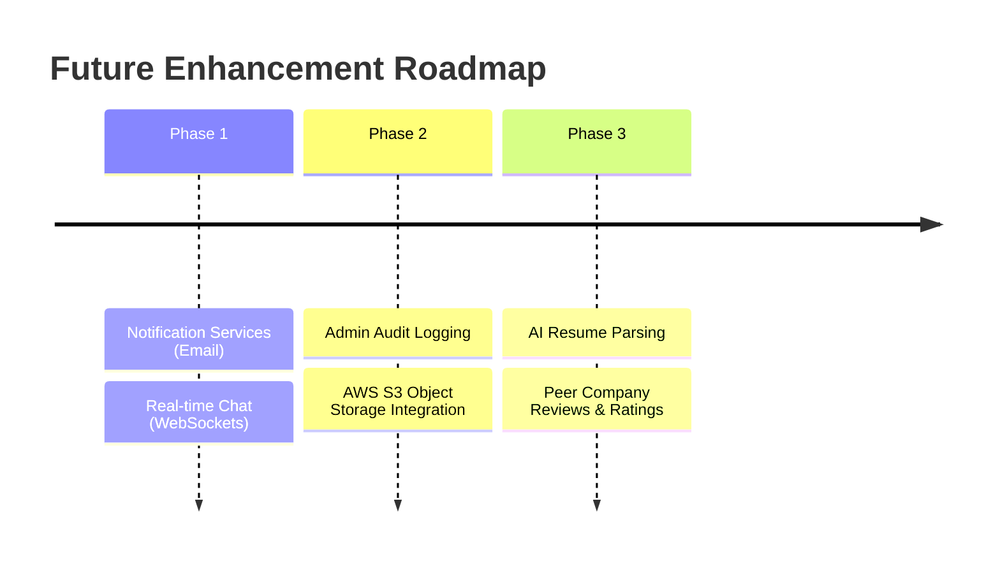

# Internship Management Portal: Project Walkthrough

This document outlines the current state, technical implementation, and future roadmap of the Internship Management Portal.

---

## 1. Technology Stack

The application is built on a modern, decoupled **three-tier client-server architecture**:

### Frontend (Client Tier)
*   **React 19 (SPA):** Leverages component-based rendering, hooks, and context state management.
*   **Vite:** High-performance local development build tool and packager.
*   **Bootstrap 5:** Fluid grid systems, UI components, and fully responsive layouts.
*   **Axios:** Abstraction layer for HTTP requests, configured with request interceptors (attaches JWT tokens) and response interceptors (handles error normalization and 401 logouts).
*   **React Router DOM v6:** Controls client-side nested routing under auth wrappers (`ProtectedRoute` and `RoleRoute`).

### Backend (Application Tier)
*   **Node.js & Express.js:** Fast, minimalist web framework running in a stateless MVC pattern.
*   **Multer:** Configured to handle file uploads securely using disk storage with random UUID filenames.
*   **express-validator:** Declares schemas to validate and sanitize parameters, body objects, and queries.
*   **bcrypt:** Performs salted password hashing (salt rounds = 10) before database persistence.
*   **jsonwebtoken (JWT):** Generates short-lived Access Tokens (15 min) and long-lived Refresh Tokens (7 days).
*   **Winston:** Centralized logging of application events and errors.

### Database (Data Tier)
*   **MySQL 8.x:** Relational SQL database.
*   **InnoDB Engine:** Enforces referential constraints (`ON DELETE CASCADE`), database transactions, and row-level locking.
*   **Connection Pool:** Managed via `mysql2/promise` to handle concurrent connections efficiently.

---

## 2. Currently Implemented Features

The portal supports three distinct user roles, each with specialized capabilities:

### Student Features
*   **Account Setup:** Secure registration, login, and token-refreshing session handling.
*   **Profile Builder:** Manage bio descriptions and upload PDF/DOCX resumes (saved securely using UUID naming).
*   **Education History (CRUD):** Add, edit, or delete institutional history entries (schools, degrees, dates, grades).
*   **Skills Profiler (CRUD):** Add, update, or remove discrete skills with proficiency levels.
*   **Internship Search:** Filter published postings by title, location, duration, and stipends using MySQL natural language full-text matching.
*   **Saved Listings:** Bookmark/unbookmark listings to view later.
*   **Single-Click Applications:** Apply to postings with cover letters and track status updates (Applied, Under Review, Shortlisted, Accepted, Rejected).
*   **In-App Alerts:** Read and manage notifications on application status changes.

### Company Features
*   **Verification Sandbox:** Self-registers and fills company profiles; posting capabilities are locked until verified by an Admin.
*   **Postings Lifecycle (CRUD):** Manage listings through different states (Draft, Published, Closed, Removed).
*   **Applicant Dashboard:** Review applicants, open uploaded student resumes, read cover letters, and transition candidate statuses.
*   **Profile Manager:** Update industry details, website URLs, and upload logo images.
*   **Analytics Panel:** View metrics on posting counts grouped by status.

### Admin Features
*   **Verification Workflow:** Approve or reject pending company registrations.
*   **User Account Moderation:** Temporarily deactivate or reactivate student/company user accounts.
*   **Internship Moderation:** Flag or remove inappropriate listings.
*   **Platform Dashboard:** View system statistics, including total students, verified companies, active listings, and total applications.

---

## 3. Future Scope & Roadmap

To evolve the portal into an enterprise-ready product, the following features are planned:

### Phase 1: Real-time Communication & Alerts
*   **Real-time Chat:** Implement WebSockets (Socket.io) to allow students and companies to chat directly within the portal.
*   **Email Notification Delivery:** Integrate NodeMailer/SendGrid to send email notifications for key events, such as application updates or company approvals.

### Phase 2: Audit Trail & Cloud Migration
*   **Admin Audit Logging:** Implement an audit logging system to track critical admin actions (such as company approvals, user deactivations, and posting flags).
*   **AWS S3 Storage Integration:** Migrate uploads from the local filesystem to cloud storage (like AWS S3) for better scalability, using signed URLs to control access to resumes.

### Phase 3: AI Capabilities & Peer Feedback
*   **AI Resume Parser:** Integrate an AI parsing service to automatically pre-fill student profile fields (like education and skills) from uploaded resumes.
*   **Peer Company Reviews:** Allow students to write reviews and rate companies after completing internships.
